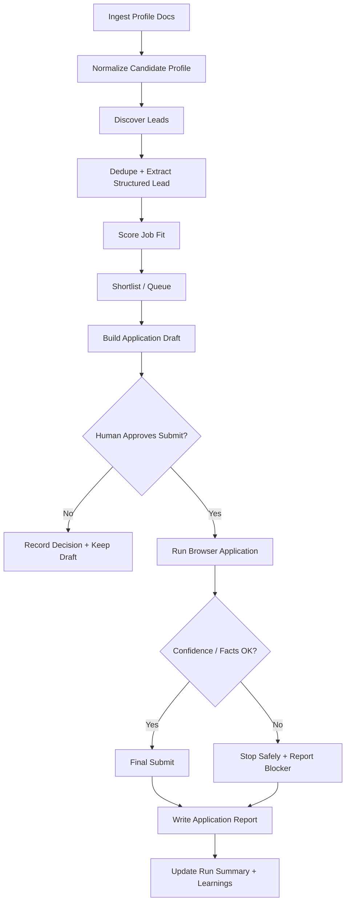

# feat: Build agent-first job hunt system

## Overview

Build `job-hunt` as an agent-first repository that helps one person discover, rank, review, and optionally apply to jobs using browser-driven automation. The first release should prioritize trust over volume: discover leads, score them, prepare application materials, and require explicit human approval before every final submission. The system should generate a durable record for each lead and application attempt, including evidence provenance, confidence, and quality scoring.

This plan carries forward the core brainstorm decisions to keep the first implementation small, domain-specific, and auditable rather than turning the repo into a generic agent framework (see brainstorm: `docs/brainstorms/2026-04-15-job-hunt-brainstorm.md`).

## Problem Statement

Manual job hunting is repetitive, fragmented, and difficult to audit. Relevant information about the candidate is spread across resumes, cover letters, work notes, and answer snippets. Application workflows vary across job boards and company sites, which makes quality inconsistent and record-keeping weak. Existing automation ideas often optimize for submission count before they solve the harder problem: whether the software can be trusted to answer accurately and stop when it lacks evidence.

For this repo, the primary problem is not "how do we auto-click forms?" It is "how do we create a trustworthy job-search operating system that can make good decisions, stay honest about uncertainty, and leave a usable paper trail?"

## Proposed Solution

Create a CLI-and-files based operating repo with five core layers:

1. `profile intelligence`
   ingest raw documents into a normalized candidate profile that the agent can query quickly
2. `lead pipeline`
   discover, dedupe, normalize, and score job opportunities
3. `approval queue`
   present ranked leads and prepared applications for explicit approval before submit
4. `browser application runner`
   execute application steps with guarded browser usage, low-tab operation, and confidence stops
5. `reporting and learning`
   write detailed lead/application/run artifacts that show fit, provenance, confidence, and outcomes

The recommended v1 implementation is file-backed and repo-native:
- markdown for human-readable docs and reports
- JSON for machine-readable records
- Python scripts for normalization, scoring, and reporting helpers
- repo-local configuration for runtime policies
- Claude Code browser execution guided by project instructions and playbooks

## Technical Approach

### Architecture

Use an agent-operating-repo structure instead of a web application:

```text
job-hunt/
├── AGENTS.md
├── README.md
├── config/
│   ├── runtime.yaml
│   ├── scoring.yaml
│   └── sources.yaml
├── docs/
│   ├── brainstorms/
│   ├── plans/
│   ├── profile/
│   └── reports/
├── profile/
│   ├── raw/
│   ├── normalized/
│   └── preferences/
├── data/
│   ├── leads/
│   ├── applications/
│   ├── companies/
│   ├── runs/
│   └── indexes/
├── prompts/
│   ├── scoring/
│   ├── answering/
│   ├── review/
│   └── reporting/
├── playbooks/
│   ├── discovery/
│   ├── application/
│   └── fallback/
├── schemas/
│   ├── candidate-profile.schema.json
│   ├── lead.schema.json
│   ├── application-draft.schema.json
│   ├── application-report.schema.json
│   └── run-summary.schema.json
└── scripts/
    ├── normalize_profile.py
    ├── extract_lead.py
    ├── score_lead.py
    ├── build_application_draft.py
    ├── write_application_report.py
    └── summarize_run.py
```

Recommended v1 runtime policies:

```yaml
# config/runtime.yaml
approval_required_before_submit: true
approval_required_before_account_creation: true
allow_auto_submit: false
answer_policy: strict
allow_inferred_answers: true
allow_speculative_answers: false
browser_tabs_soft_limit: 10
browser_tabs_hard_limit: 15
close_background_tabs_aggressively: true
stop_if_confidence_below: 0.75
stop_if_required_fact_missing: true
secret_source: env_or_local_untracked_file
redact_secrets_in_artifacts: true
```

This keeps your newest constraints explicit and easily toggleable.

### Data Model

#### Candidate Profile

Store both raw and normalized profile material.

`profile/raw/`
- resumes
- cover letters
- work notes
- project summaries
- question bank drafts

`profile/normalized/`
- `candidate-profile.json`
- `skills.json`
- `experience-timeline.json`
- `answer-bank.json`
- `preferences.json`

The normalized profile should support source provenance so important statements can point back to the raw documents that justify them (see brainstorm: `docs/brainstorms/2026-04-15-job-hunt-brainstorm.md`).

#### Lead Record

Each lead should include:
- `lead_id`
- source and URL
- company metadata
- title and location
- compensation if available
- raw job description
- normalized requirements
- dedupe fingerprint
- fit scoring breakdown
- current status: `discovered | shortlisted | skipped | drafted | approved | applied | failed`

#### Application Draft

Create a draft before any submit attempt:
- lead reference
- selected resume and cover letter assets
- prepared answers
- provenance for each answer: `grounded | synthesized | weak_inference | speculative`
- missing facts
- human review summary
- approval status

#### Application Report

After each attempt, create:
- whether approval was required
- whether approval was obtained
- submission status
- whether submit was attempted
- whether submission was confirmed
- final answers sent
- question-by-question provenance
- confidence and truthfulness summary
- blocker/failure log
- browser notes and screenshots metadata
- browser tab metrics: opened, peak_open_tabs, closed_for_budget, hard_limit_hit
- application quality score
- secrets-redaction status

### User Flow Overview



### Flow Permutations Matrix

| Flow | User State | System Behavior |
| --- | --- | --- |
| Lead discovery | no existing profile normalization | stop after discovery prep and request profile ingestion |
| Lead scoring | complete normalized profile | compute fit score and shortlist recommendation |
| Draft creation | some answers unsupported | generate draft, flag missing facts, require review |
| Submit path | v1 default | always pause for human approval before final submit |
| Submit path | future toggle enabled | allow auto-submit only when runtime policy allows it |
| Browser run | under tab soft limit | continue normally |
| Browser run | reaches tab soft limit | close unnecessary tabs before opening new ones |
| Browser run | reaches tab hard limit | stop opening tabs and fail safely |
| Site flow | account already exists | sign in and continue |
| Site flow | account required | create account only if runtime policy allows and record that action |
| Question answering | strict evidence available | answer from profile source truth |
| Question answering | only inference available | allow only if inference policy permits and label it |
| Question answering | unsupported fact required | stop or send to review based on runtime policy |

### Implementation Phases

#### Phase 1: Repository Foundation

Deliverables:
- initialize git repo and base directories
- create `README.md`, `AGENTS.md`, and config files
- add schemas for profile, lead, draft, report, and run summary
- add sample placeholder files and naming conventions

Success criteria:
- repo has a stable structure for profile data, leads, applications, and reports
- runtime policies include approval gating and browser tab budgets
- contributors can understand the system from docs alone

Estimated effort:
- 1 to 2 working sessions

#### Phase 2: Profile Intelligence Layer

Deliverables:
- define normalized candidate profile schema
- ingest documents from `profile/raw/`
- build `scripts/normalize_profile.py`
- generate reusable answer bank and experience inventory

Success criteria:
- profile normalization produces machine-readable artifacts with provenance
- the system can answer common application prompts from normalized data
- unsupported facts are flagged rather than silently invented

Estimated effort:
- 2 to 4 working sessions

#### Phase 3: Lead Discovery And Scoring

Deliverables:
- define lead schema and dedupe rules
- create source configuration and discovery playbooks
- implement scripts for extraction and fit scoring
- write shortlist/reporting outputs

Success criteria:
- new leads are captured in a common format
- duplicate postings are identified reliably
- each lead receives an evidence-backed fit score and recommendation

Estimated effort:
- 2 to 5 working sessions

#### Phase 4: Drafted Application Workflow

Deliverables:
- define application draft schema
- implement draft generation from lead + profile
- create answer provenance model and confidence thresholds
- add markdown review summaries for human approval
- define approval records for both account creation and final submit decisions

Success criteria:
- every submission candidate is reviewable before browser execution
- draft artifacts expose missing facts, weak inferences, and asset selection
- approval can be recorded explicitly before final submit
- account-creation approval requirements are explicit before browser execution starts

Estimated effort:
- 2 to 4 working sessions

#### Phase 5: Reporting, Audit Trail, And Execution Preconditions

Deliverables:
- define application report schema and run summary schema
- generate per-application markdown reports and JSON records
- generate per-run summaries
- define checkpoint write rules before browser execution, before submit attempt, and after terminal outcomes
- validate that required audit fields are present for every attempt

Success criteria:
- every application attempt has a durable machine-readable and human-readable audit trail before browser automation is enabled
- partial failures preserve enough context to explain what happened
- report artifacts satisfy the `AGENTS.md` reporting requirements

Estimated effort:
- 2 to 4 working sessions

#### Phase 6: Browser Execution With Guardrails

Deliverables:
- write browser playbooks for job boards and company sites
- codify tab lifecycle rules and confidence stop conditions
- define safe account-creation behavior
- implement reporting hooks for screenshots, blockers, and final outcomes

Success criteria:
- browser runs stay under soft and hard tab limits
- the runner stops when confidence is too low or evidence is missing
- final submit never happens in v1 without explicit human approval

Estimated effort:
- 3 to 6 working sessions

#### Phase 7: Metrics, Outcomes, And Learning Loop

Deliverables:
- track outcomes like interview, rejection, ghosted, withdrawn
- identify profile gaps and scoring calibration needs

Success criteria:
- every application has a durable audit trail
- outcome tracking supports future tuning
- the system can explain both fit quality and answer quality

Estimated effort:
- 2 to 4 working sessions

## Alternative Approaches Considered

### Full Auto-Apply From Day One

Rejected for v1 because it creates the most risk with the least trust. It also clashes with your explicit preference to require human approval before each submit in the first release (see brainstorm: `docs/brainstorms/2026-04-15-job-hunt-brainstorm.md`).

### Traditional Web App First

Rejected for v1 because the repo's real value is candidate context, scoring logic, browser playbooks, and audit trails. A UI can come later if the file-backed operating model proves valuable.

### Copy Everything Claude Code As A Base

Rejected as a direct foundation. ECC is better used as a pattern library for project instructions, workflow skills, hook ideas, and quality gates rather than copied wholesale into a domain-specific repo.

## System-Wide Impact

### Interaction Graph

1. `profile/raw/*.md|pdf` changes trigger profile normalization, which writes `profile/normalized/*.json`.
2. normalized profile feeds lead scoring and application draft generation.
3. lead discovery writes `data/leads/*.json`, which influences shortlist state and application drafting.
4. application drafting writes `data/applications/*.json` plus review markdown in `docs/reports/`.
5. human approval updates draft state, which unlocks browser execution.
6. browser execution writes report artifacts, updates run summaries, and may append to company/account history.

Two levels deep example:
- approving an application draft updates draft status
- updated draft status unlocks browser execution
- browser execution can create a submission report
- submission report updates company/application history and future scoring context

### Error & Failure Propagation

Expected failure classes:
- profile parsing failure
- lead extraction failure
- duplicate detection mismatch
- unsupported-question failure
- browser navigation failure
- site-auth failure
- tab-budget exhaustion
- submit-confirmation ambiguity

Handling approach:
- parsing and extraction failures should stop artifact generation for that item and write structured error entries
- unsupported facts should downgrade confidence and usually stop submission in v1
- browser failures should write partial reports instead of disappearing
- hard tab-limit breach should stop the run, close nonessential tabs if possible, and mark the attempt as failed safely

### State Lifecycle Risks

Potential risks:
- duplicate lead records for reposted jobs
- drafts generated from stale profile data
- partial browser completion without reliable submission confirmation
- account creation completed but application not submitted
- reports written without full provenance if intermediate steps fail

Mitigations:
- content fingerprinting for leads
- profile normalization versioning on drafts and reports
- explicit `attempted_submit` vs `confirmed_submitted` fields
- checkpoint writes after major browser milestones
- separate machine-readable status from narrative report text

### API Surface Parity

Equivalent interfaces that must share the same policy rules:
- lead scoring prompt and script outputs
- application draft generator
- browser execution playbooks
- markdown report renderer
- runtime config toggles

If approval or answer-policy rules change, all of these surfaces must stay aligned. The approval gate cannot exist only in a prompt while the reporting layer assumes different behavior.

### Secret Handling Boundary

Credential use must be designed as a first-class runtime boundary rather than left implicit.

V1 decision:
- store secrets only in environment variables or local untracked files such as `.env.local`
- do not persist secrets, session tokens, or one-time codes into git-tracked artifacts
- reports may record that authentication was required, attempted, reused, or blocked, but must redact secret values
- browser playbooks should read credentials through a narrow runtime interface so logging and screenshots can be filtered consistently

This keeps authentication support compatible with the repo's trust goal without normalizing secret leakage into reports or config.

### Integration Test Scenarios

1. profile normalization creates a candidate profile that can answer a common application question without rereading raw files
2. duplicate job postings from two sources collapse to one canonical lead while preserving source links
3. application draft contains a mix of grounded and inferred answers and correctly blocks unsupported required answers
4. browser application flow hits the soft tab limit, closes background tabs, and continues without crossing the hard limit
5. human rejects a draft after review and the system records the rejection without attempting submit
6. browser reaches submit-adjacent step but cannot confirm final submission, and the report marks the attempt as ambiguous instead of submitted

## Acceptance Criteria

### Functional Requirements

- [x] The repo defines a stable directory structure for profile data, leads, application drafts, reports, and runtime config.
- [x] The system can ingest raw candidate documents and produce normalized profile artifacts with provenance.
- [x] The system can represent discovered jobs in a normalized lead schema with dedupe support.
- [x] Every lead receives a job fit score with a scoring breakdown and recommendation.
- [x] The system can generate an application draft before any browser submission attempt.
- [x] Every prepared answer includes a provenance label and confidence signal.
- [x] V1 requires explicit human approval before each final application submission.
- [x] The approval gate can be toggled via configuration for later versions without redesigning the architecture.
- [x] Browser execution enforces a soft tab limit of 10 and a hard tab limit of 15 by policy.
- [x] Every application attempt produces both a machine-readable record and a human-readable report.
- [x] Reports distinguish grounded facts, synthesis, weak inference, and speculative content.
- [x] The system records whether an account was reused or created during an application flow.

### Non-Functional Requirements

- [x] The v1 architecture remains file-backed and understandable without a database.
- [x] Sensitive credentials are never stored in git-tracked reports or config files.
- [x] Failure states are recoverable enough to preserve partial artifacts and debugging context.
- [x] The runtime behavior is policy-driven so trust/safety controls are easy to change later.

### Quality Gates

- [x] Schemas exist for all primary artifacts and examples validate against them.
- [x] Config files document defaults for approval, answer policy, and tab budgets.
- [x] The plan's end-to-end flow is documented in repo docs and reflected in `AGENTS.md`.
- [x] Browser execution cannot be enabled until report schemas and checkpoint writes exist.
- [x] Scripts include basic verification coverage for normalization, scoring, and report generation.

## Success Metrics

- 100% of submission attempts in v1 require recorded human approval before final submit
- 100% of application reports include provenance and confidence fields
- 0 credentials are written to git-tracked reports
- at least 90% of discovered duplicates are collapsed correctly during initial validation
- average browser runs stay below the soft tab budget for normal application flows
- every failed application attempt produces a report with actionable failure context

## Dependencies & Prerequisites

- GitHub repository under `kashane1`
- local Claude Code environment with browser/computer-use capability available at runtime
- candidate documents placed in `profile/raw/`
- local secret material available through environment variables or ignored local files

## Risk Analysis & Mitigation

### Risk: unsupported facts lead to low-quality or dishonest answers

Mitigation:
- default to `strict` answer policy
- permit labeled inference but not speculative facts in v1
- stop submission when required facts are missing

### Risk: site variability breaks generic browser flows

Mitigation:
- separate generic playbooks from site-specific fallback playbooks
- keep detailed failure logs and screenshots metadata
- start with a small set of supported sources

### Risk: tab sprawl slows the machine and destabilizes runs

Mitigation:
- encode soft/hard tab budgets in runtime config
- aggressively close background tabs
- design playbooks to reuse the current tab where possible

### Risk: repo becomes an overbuilt framework before proving value

Mitigation:
- file-backed v1
- no database requirement
- no web UI requirement
- adopt only selected ECC patterns instead of wholesale copying

### Risk: secrets leak into tracked files

Mitigation:
- never write passwords to reports
- prefer `.env.local` or equivalent ignored files for local secrets
- include redaction guidance in `AGENTS.md`
- require report-generation code to mark when secret redaction was applied

## Resource Requirements

- one repo maintainer/operator
- Python runtime for local helper scripts
- time to prepare candidate documents and normalize them
- ongoing manual review time for v1 approval gating

## Future Considerations

- optional SQLite index if file-backed records become hard to query
- richer site adapters for common ATS platforms
- automated follow-up and status tracking
- scoring calibration from interview outcomes
- selective auto-submit for high-confidence, policy-compliant applications
- custom dashboards or UI once the workflow stabilizes

## Documentation Plan

Create or update:
- `README.md` with repo purpose, phases, and usage model
- `AGENTS.md` with trust policy, tab-budget policy, artifact locations, and report requirements
- `docs/profile/` guidance for what candidate materials to add
- `docs/reports/` template examples
- `playbooks/` docs for supported discovery and application flows

## V1 Decisions

- First-class sources in v1 should be company career sites plus one or two common boards only after the company-site flow works end to end. This keeps browser playbooks narrow and auditable.
- Initial profile ingestion should support markdown and PDF only. DOCX can be added later once the normalization path is stable.
- The initial browser stop threshold should be `0.75`, matching runtime policy, and should be revisited only after real report data exists.
- Account creation may be supported in v1, but it should require a separate explicit approval checkpoint before the action is taken.

## Recommended Sequence Of Work

1. scaffold repo structure, config files, schemas, and baseline docs
2. define normalized profile schema and ingest the first real candidate materials
3. implement lead extraction, dedupe, and fit scoring
4. implement application draft generation and approval recording
5. implement report schemas, checkpoint writes, and run summaries
6. implement browser playbooks with tab-budget enforcement
7. implement outcomes tracking and learning-loop calibration

## Sources & References

### Origin

- **Brainstorm document:** `docs/brainstorms/2026-04-15-job-hunt-brainstorm.md`
  carried-forward decisions:
  - start with search/score first and apply second
  - default to no fabricated facts
  - use separate fit and application-quality scoring

### Internal References

- current repo state: greenfield repository with only brainstorm documentation

### External References

- [affaan-m/everything-claude-code](https://github.com/affaan-m/everything-claude-code) for reusable patterns around `AGENTS.md`, skills, hooks, memory, and evals

### Related Work

- none yet; this is the founding plan for the repository
