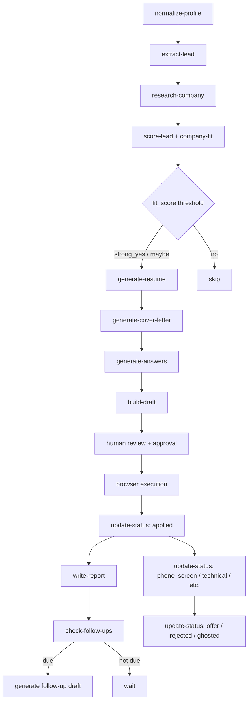

# feat: Content generation, application tracking, company research, and follow-up system

## Enhancement Summary

**Deepened on:** 2026-04-16
**Review agents used:** architecture-strategist, kieran-python-reviewer, performance-oracle, security-sentinel, code-simplicity-reviewer, pattern-recognition-specialist, data-integrity-guardian, best-practices-researcher

### Key Improvements From Review

1. **CRITICAL: Add data directories to `.gitignore`** — Generated resumes, answer sets, and company research contain PII (name, email, phone, salary, work authorization). Currently nothing prevents these from being pushed to a remote. Must fix before Phase 1.
2. **Extract shared utilities into `utils.py`** — Prevents bidirectional imports between `core.py` and new modules.
3. **Simplify the variant system** — Drop `config/generation.yaml` and the structured `RESUME_VARIANT_STYLES` dict. Use simple style strings and inline logic. Promote to config only when there is data on what works.
4. **Make `write_json` atomic** — Use write-to-temp-then-rename to prevent corruption on interrupted writes.
5. **Drop `combined_recommendation`** — Keep job fit and company fit as independent scores. Let the human judge.
6. **Simplify state machine** — Validate stage name and reject transitions FROM terminal stages only. Drop the full transition matrix.
7. **Normalize token-overlap scoring** — Use Jaccard similarity instead of raw intersection to avoid bias toward verbose accomplishments.
8. **Pre-compile ATS knockout regex at module level** — Follow existing `SKILL_ALIAS_PATTERNS` convention.
9. **Add `check-integrity` as a Phase 1 deliverable** — Detect orphaned content, dangling references, and broken cross-file links.
10. **Follow-up timing adjustment** — Research says 10 days and 24 days post-application, not 7 and 14.

### Simplification Decisions (from simplicity review)

| Original | Simplified | Rationale |
|---|---|---|
| `RESUME_VARIANT_STYLES` config dict | Simple style string + inline logic | No data yet on what differentiates variants |
| `VALID_TRANSITIONS` 10-entry matrix | Terminal-stage-only validation | Full matrix is overdesigned for single-user CLI |
| `ATS_KNOCKOUT_QUESTIONS` regex framework | Keyword dict following `_lead_missing_facts` pattern | 6 categories don't need a framework |
| `combined_recommendation` | Drop entirely; show both scores | Contradicts "never merged" principle |
| `profile_snapshot_hash` per artifact | `generated_at` timestamp only | Profile changes ~monthly; `--force` flag is simpler |
| `follow_up_draft_path` on status | Naming convention lookup | Avoids cross-reference maintenance |
| `config/generation.yaml` | Python constants in module | Promote to config when needed |
| `metadata` catch-all on schema | Remove; name fields explicitly or omit | Untyped bags invite undocumented growth |
| `selected_accomplishments` sub-objects | Flat string list for v1 | `relevance_score` has no downstream consumer |

## Overview

Add 9 features to the job-hunt repo that transform it from a profile-ingestion and draft-building tool into a full application lifecycle manager. The features span four domains:

1. **Content generation** — Tailored resume generator, cover letter generator, full answer generator
2. **Tracking** — Resume variant tracker, application status tracker, version control for generated content
3. **Intelligence** — Company research enrichment, company fit scoring
4. **Engagement** — Follow-up reminder system

All features follow the repo's existing conventions: file-backed JSON artifacts, CLI subcommands via argparse, JSON schemas, provenance tracking, strict answer policy, and human approval gates.

## Problem Statement

The current pipeline can normalize a candidate profile, score leads, and build basic application drafts. But it has critical gaps:

- **No content generation.** The system selects existing documents but cannot create tailored resumes or cover letters. The `_pick_document` helper picks the one best-matching raw doc — it cannot synthesize new content from the achievement bank.
- **No lifecycle tracking.** Once an application is submitted, the system loses track. There is no status progression, no outcome recording, no way to correlate what was sent with what happened.
- **No company intelligence.** Scoring is based purely on the job description text. The system knows nothing about the company itself (size, funding, tech stack, culture, remote policy).
- **No follow-up.** Most candidates don't follow up. The system has no mechanism to remind or draft follow-up communications.

## Proposed Solution

Build these 9 features in 5 phases, ordered by data model dependencies identified in the spec-flow analysis. Each phase produces working CLI commands, schemas, tests, and documentation.

## Technical Approach

### Architecture

New directory structure (additions only):

```text
job-hunt/
├── data/
│   ├── applications/            # existing: drafts and reports
│   ├── companies/               # NEW: company research JSON files
│   └── generated/               # NEW: generated content artifacts
│       ├── resumes/             # generated resume variants
│       ├── cover-letters/       # generated cover letters
│       └── answers/             # generated answer sets
├── prompts/
│   ├── generation/              # NEW: prompts for content generation
│   │   ├── resume-variants.md
│   │   └── cover-letter.md
│   └── research/                # NEW: prompts for company research
│       └── company-enrichment.md
├── schemas/
│   ├── company-research.schema.json    # NEW
│   ├── application-status.schema.json  # NEW
│   └── generated-content.schema.json   # NEW
└── src/job_hunt/
    ├── core.py                  # extend with new commands
    ├── generation.py            # NEW: content generation logic
    ├── tracking.py              # NEW: application status tracking
    ├── research.py              # NEW: company research enrichment
    └── reminders.py             # NEW: follow-up reminder system
```

**Design decision: separate modules, not one giant core.py.**

`core.py` is already 1800+ lines. New features go in focused modules. `core.py` continues to own the CLI dispatch. New modules import shared helpers from a new `src/job_hunt/utils.py` module (extracted from `core.py`) containing: `write_json`, `read_json`, `slugify`, `short_hash`, `now_iso`, `ensure_dir`, `unique_preserve_order`, `load_yaml_file`, `tokens`. `core.py` re-exports these for backward compatibility.

### Research Insights: Architecture

**From architecture review:** The four-module split is architecturally sound. Each module maps to a distinct domain with low natural coupling. Modules communicate through the filesystem as a shared bus, with JSON schemas as data contracts. No circular dependencies exist because all modules import from `utils.py`, not from each other.

**From simplicity review:** Phases 2 and 3 are independent of each other (both depend only on Phase 1). They can be implemented in either order or in parallel if priorities shift.

**From pattern review:** New CLI commands should use `--help` text. Tests should go in separate files per module: `tests/test_tracking.py`, `tests/test_generation.py`, `tests/test_research.py`, `tests/test_reminders.py`. Each test that produces a file artifact must validate it against its schema.

### Prerequisite: Security Hardening (Before Phase 1)

**CRITICAL finding from security review:** Generated resumes, answer sets, and company research files contain PII (candidate name, email, phone, salary expectations, work authorization status). Currently `.gitignore` does not exclude any data directories. A single accidental push would expose everything.

**Required before any implementation begins. The `.gitignore` commit must be the FIRST commit, isolated, before creating any new files or running any generation commands.**

1. Add to `.gitignore`:
   ```
   # Candidate PII and generated artifacts
   profile/raw/
   profile/normalized/
   data/generated/
   data/companies/
   data/applications/
   data/leads/
   data/runs/
   docs/reports/*-report.md
   examples/results/
   *.tmp
   ```

2. Extend `SENSITIVE_KEYWORDS` in `core.py` — but clarify scope:
   ```python
   SENSITIVE_KEYWORDS = (
       "password", "passwd", "secret", "token", "otp",
       "one_time_code", "verification_code", "session", "cookie",
       "salary", "compensation",
   )
   ```
   **Scope clarification:** `SENSITIVE_KEYWORDS` protects against credential leakage in browser attempt payloads via `redact_sensitive_data()`. It does NOT protect PII in generated content (resumes, cover letters) — those files intentionally contain PII. PII protection for generated artifacts relies on `.gitignore` directory exclusion, NOT field-level redaction. Do not add `"email"`, `"phone"`, or `"authorization"` to `SENSITIVE_KEYWORDS` — those are valid keys in the candidate profile.

3. Make `write_json` atomic with error cleanup:
   ```python
   import os

   def write_json(path: Path, payload: dict) -> None:
       ensure_dir(path.parent)
       tmp = path.with_suffix(".tmp")
       try:
           tmp.write_text(json.dumps(payload, indent=2, sort_keys=True) + "\n", encoding="utf-8")
           os.replace(str(tmp), str(path))
       except BaseException:
           tmp.unlink(missing_ok=True)
           raise
   ```
   Uses `os.replace()` (atomic on all platforms) instead of `Path.rename()` (fails on Windows if destination exists). Paired `.json` + `.md` content writes should use a helper that writes both to `.tmp` then renames both.

4. Extract shared utilities from `core.py` into `src/job_hunt/utils.py`.
   **Scope:** `utils.py` contains pure utility functions with zero domain knowledge: `write_json`, `read_json`, `slugify`, `short_hash`, `now_iso`, `ensure_dir`, `unique_preserve_order`, `load_yaml_file`, `tokens`, `display_path`, `parse_frontmatter`, `meaningful_lines`. Domain-specific constants and regex patterns stay in their respective modules. `core.py` re-exports all utils for backward compatibility.

### Data Model

#### Generated Content Record (`generated-content.schema.json`)

```json
{
  "$schema": "https://json-schema.org/draft/2020-12/schema",
  "title": "GeneratedContent",
  "type": "object",
  "required": ["content_id", "content_type", "variant_style", "generated_at",
               "lead_id", "source_document_ids"],
  "properties": {
    "content_id": { "type": "string" },
    "content_type": { "enum": ["resume", "cover_letter", "answer_set"] },
    "variant_style": { "type": "string" },
    "generated_at": { "type": "string" },
    "lead_id": { "type": "string" },
    "job_title": { "type": "string" },
    "source_document_ids": { "type": "array", "items": { "type": "string" } },
    "selected_accomplishments": { "type": "array", "items": { "type": "string" } },
    "selected_skills": { "type": "array", "items": { "type": "string" } },
    "output_path": { "type": "string" },
    "provenance": { "enum": ["grounded", "synthesized", "weak_inference"] }
  }
}
```

**Key design decisions:**
- `variant_style` — Free string (e.g., "technical_depth", "impact_focused", "breadth"). Not an enum so new styles can be added without schema changes.
- `selected_accomplishments` — Flat list of summary strings for v1. Per-accomplishment `relevance_score` deferred (no downstream consumer yet).

**Research insight (simplicity review):** The original `profile_snapshot_hash` field has been removed. Profile changes ~monthly for a single user. Staleness is better handled by comparing `generated_at` timestamps and a `--force` flag on regeneration commands. The `metadata` catch-all object has also been removed — if a field matters, name it explicitly in the schema.

**Research insight (data integrity review):** The `output_path` field creates a coupling between metadata and file layout. Code consuming generated content records should verify file existence before using the path. Implement a `resolve_content_path(content_id, base_dir)` function for deterministic ID-to-path mapping.

#### Application Status Record (`application-status.schema.json`)

```json
{
  "$schema": "https://json-schema.org/draft/2020-12/schema",
  "title": "ApplicationStatus",
  "type": "object",
  "required": ["lead_id", "current_stage", "transitions", "created_at", "updated_at"],
  "properties": {
    "lead_id": { "type": "string" },
    "current_stage": {
      "enum": ["not_applied", "applied", "phone_screen", "technical",
               "onsite", "offer", "accepted", "rejected", "withdrawn", "ghosted"]
    },
    "transitions": {
      "type": "array",
      "items": {
        "type": "object",
        "required": ["from_stage", "to_stage", "timestamp"],
        "properties": {
          "from_stage": {
            "enum": ["not_applied", "applied", "phone_screen", "technical",
                     "onsite", "offer", "accepted", "rejected", "withdrawn", "ghosted"]
          },
          "to_stage": {
            "enum": ["not_applied", "applied", "phone_screen", "technical",
                     "onsite", "offer", "accepted", "rejected", "withdrawn", "ghosted"]
          },
          "timestamp": { "type": "string" },
          "note": { "type": "string" }
        }
      }
    },
    "generated_content_ids": {
      "type": "array",
      "items": { "type": "string" }
    },
    "follow_up": {
      "type": "object",
      "properties": {
        "next_follow_up_date": { "type": "string" },
        "follow_up_count": { "type": "integer" },
        "suppress_follow_up": { "type": "boolean" }
      }
    },
    "outcome_notes": { "type": "string" },
    "created_at": { "type": "string" },
    "updated_at": { "type": "string" }
  }
}
```

**Key design decisions:**
- `transitions` array — Full audit trail. Stages can be skipped (e.g., applied → technical with no phone screen). Each transition has a timestamp and optional note.
- `generated_content_ids` — Links to all content generated for this application (resume variants, cover letters, answer sets). This is the resume variant tracker.
- `follow_up` — Embedded in the status record, not a separate entity. Keeps the data model simple. `follow_up_draft_path` removed per simplicity review — use naming convention (`data/generated/follow-ups/{lead-id}-*.md`) instead.
- `suppress_follow_up` — Explicit flag for when follow-up is inappropriate (company said no, role was withdrawn).

**Research insight (data integrity review):** Constrain `from_stage` and `to_stage` in the transitions schema to the same enum as `current_stage`. Without this, a bug could record invalid stage names in the audit trail without schema validation catching it.

**Research insight (simplicity review):** The `ghosted` stage should not be fully terminal. Companies sometimes resurface weeks later. Allow `ghosted` → interview stages as a valid transition. Document this explicitly.

#### Company Research Record (`company-research.schema.json`)

```json
{
  "$schema": "https://json-schema.org/draft/2020-12/schema",
  "title": "CompanyResearch",
  "type": "object",
  "required": ["company_id", "company_name", "researched_at"],
  "properties": {
    "company_id": { "type": "string" },
    "company_name": { "type": "string" },
    "researched_at": { "type": "string" },
    "size_estimate": { "type": "string" },
    "stage": { "enum": ["startup", "growth", "public", "enterprise", "unknown"] },
    "industry": { "type": "string" },
    "tech_stack": { "type": "array", "items": { "type": "string" } },
    "remote_policy": { "type": "string" },
    "glassdoor_rating": { "type": "number" },
    "funding_info": { "type": "string" },
    "headquarters": { "type": "string" },
    "recent_news": { "type": "array", "items": { "type": "string" } },
    "source_urls": { "type": "array", "items": { "type": "string" } },
    "confidence": { "enum": ["high", "medium", "low"] },
    "company_fit_score": { "type": "number" },
    "company_fit_breakdown": {
      "type": "object",
      "properties": {
        "remote_match": { "type": "number" },
        "size_match": { "type": "number" },
        "tech_stack_match": { "type": "number" },
        "industry_match": { "type": "number" }
      }
    },
    "notes": { "type": "string" }
  }
}
```

**Key design decisions:**
- Company research lives in `data/companies/{company-id}.json`, NOT on the lead record. Multiple leads can reference the same company. Research is done once per company, reused across leads.
- `company_fit_score` is separate from job `fit_score`. They are displayed together but never merged into a single number. This avoids reweighting the existing scoring model. The `combined_recommendation` has been dropped per simplicity review — let the human judge.
- `confidence` field — Company research from different sources has different trust levels. Manual entry is "high", scraped data is "medium", inferred data is "low".

**Research insight (pattern review):** Use `"type": "number"` not `"type": "integer"` for `company_fit_score` to match existing score field conventions across all schemas.

**Research insight (security review):** Add a `data_source` field to document provenance of each claim. The `notes` field should have content policy guidance in `prompts/research/company-enrichment.md` prohibiting storage of named individuals' compensation data or data obtained in violation of third-party ToS.

**Research insight (best practices):** Useful free data sources for company enrichment: Clearbit (free tier, ~50 lookups/mo for size/industry/tech), Crunchbase Basic (funding), GitHub API (open-source activity as eng culture proxy). Cache aggressively — company data is slow-changing.

#### Changes to existing schemas

**`application-draft.schema.json` additions:**

```json
"selected_assets": {
  "resume_document_id": { "type": "string" },
  "resume_content_ids": { "type": "array", "items": { "type": "string" } },
  "selected_resume_content_id": { "type": "string" },
  "cover_letter_document_id": { "type": "string" },
  "cover_letter_content_id": { "type": "string" },
  "answer_set_content_id": { "type": "string" }
}
```

The existing `resume_document_id` and `cover_letter_document_id` stay for backward compatibility (selecting raw docs). New fields reference generated content. `resume_content_ids` lists all generated variants; `selected_resume_content_id` records which one was actually used.

**CRITICAL backward-compatibility constraint:** All new fields on existing schemas are OPTIONAL. They must NEVER be added to the `required` arrays. Existing artifacts must continue to pass validation. All code accessing new optional fields must use `.get()` with sensible defaults.

**`lead.schema.json` additions:**

```json
"company_research_id": { "type": "string" },
"application_status_path": { "type": "string" }
```

Light references only — the lead points to the company research and application status files but does not embed them. Both are optional and must never be added to `required`.

**`build-draft` additions:**

Add `--resume-variant <content-id>` flag. If omitted, auto-select the variant with the highest aggregate relevance score. This enables agent-native variant selection without human intervention.

### User Flow Overview



### Implementation Phases

#### Phase 1: Application Status Tracker + Version Control Foundation

**Why first:** Every downstream feature needs status tracking and content versioning. The resume generator needs a place to store variants. The follow-up system needs to know current status. The variant tracker needs status outcomes.

**New CLI commands:**

```
python3 scripts/job_hunt.py update-status \
  --lead data/leads/{lead-id}.json \
  --stage applied \
  --note "Submitted via Greenhouse"

python3 scripts/job_hunt.py check-status \
  --lead data/leads/{lead-id}.json

python3 scripts/job_hunt.py list-applications \
  --stage applied \
  --since 2026-04-01
```

**New module:** `src/job_hunt/tracking.py`

```python
# tracking.py — Application status lifecycle management

VALID_STAGES = [
    "not_applied", "applied", "phone_screen", "technical",
    "onsite", "offer", "accepted", "rejected", "withdrawn", "ghosted",
]

# accepted, rejected, withdrawn are fully terminal — no outbound transitions.
# ghosted is semi-terminal — companies sometimes resurface. Allows reactivation
# to interview stages but suppresses follow-ups by default.
TERMINAL_STAGES = {"accepted", "rejected", "withdrawn"}
SEMI_TERMINAL_STAGES = {"ghosted"}

def create_application_status(lead_id: str, output_dir: Path) -> dict: ...

def update_application_status(status_path: Path, new_stage: str, note: str = "") -> dict:
    """Validate: (a) new_stage in VALID_STAGES, (b) current not in TERMINAL_STAGES,
    (c) not a no-op (same stage). Ghosted can transition to non-terminal stages."""
    ...

def list_applications(status_dir: Path, stage_filter: str = "", since: str = "") -> list[dict]:
    """Returns JSON array to stdout. Each entry: lead_id, company, title, current_stage,
    applied_date, updated_at. Parseable by agents."""
    ...

def check_integrity(data_root: Path) -> dict:
    """Single-pass set-difference scan. Returns JSON report with:
    - orphaned_content: content IDs not referenced by any status record
    - dangling_leads: status records whose lead_id has no matching lead file
    - dangling_companies: lead company_research_id pointing to missing company files
    - unreferenced_companies: company files not referenced by any lead
    Implementation: build in-memory ID sets per directory, compute set differences. O(n) total."""
    ...

def link_generated_content(status_path: Path, content_id: str) -> dict: ...
```

**Key behaviors (simplified per review):**
- `update_application_status` validates that (a) the new stage is in `VALID_STAGES`, (b) the current stage is not terminal (except `ghosted` which can transition to interview stages), and (c) the transition is not a no-op (same stage). This replaces the full transition matrix with simpler, clearer validation.
- Every transition appends to the `transitions` array with a timestamp and optional note.
- Terminal stages (`accepted`, `rejected`, `withdrawn`) suppress further follow-ups automatically by setting `suppress_follow_up: true`. `ghosted` sets `suppress_follow_up: true` but allows reactivation.
- Add terminal stages to the transitions map with empty sets for explicitness.
- All new optional field accesses must use `.get()` with defaults for backward compatibility with older artifacts.

**Research insight (data integrity review):** Add a `check-integrity` CLI command as a Phase 1 deliverable. It scans all artifact directories and reports: dangling `lead_id` references, orphaned generated content, missing back-references, and company research files not referenced by any lead. Reports findings without deleting anything (requires explicit `--prune` flag to clean up).

**Research insight (performance review):** Consider a lightweight `data/applications/_index.json` that maps `lead_id -> {current_stage, next_follow_up_date, suppress_follow_up}`. Updated on every `update-status` call. This makes `check-follow-ups` O(1) instead of scanning all status files. Worth adding if the tool will be used in cron-like automation.

**Version control foundation (simplified):**

Staleness detection via `profile_snapshot_hash` has been removed per simplicity review. Instead, each generated artifact stores a `generated_at` timestamp. Generation commands accept a `--force` flag to regenerate regardless of existing content.

Generated content files are named with a timestamp suffix to prevent overwrites:

```
data/generated/resumes/{lead-id}-technical-depth-20260415T143022.json
data/generated/resumes/{lead-id}-technical-depth-20260415T143022.md
```

The JSON metadata file and the markdown content file are always paired. The JSON tracks provenance; the markdown is the human-readable output.

**New schemas:** `application-status.schema.json`, `generated-content.schema.json`

**Status relationship between `lead.status` and `application.current_stage`:**

`lead.status` tracks the discovery phase (discovered/shortlisted/skipped) and is set by `score-lead`. `application_status.current_stage` tracks the application lifecycle (applied through outcome). They serve different purposes and do NOT need synchronization. `summarize-run` should read from both to report discovery counts and application lifecycle counts separately.

**Tests** (in `tests/test_tracking.py`):
- `test_create_and_update_application_status` — Create status, advance through stages, verify transitions array, verify `from_stage`/`to_stage` are valid enum values
- `test_invalid_transition_rejected` — Attempt rejected → applied, verify error
- `test_noop_transition_rejected` — Attempt applied → applied, verify error
- `test_terminal_stage_suppresses_follow_up` — Move to rejected, verify `suppress_follow_up` is true
- `test_ghosted_allows_reactivation` — Move to ghosted, then to phone_screen, verify success
- `test_list_applications_returns_json` — Verify output is a parseable JSON array with expected keys
- `test_list_applications_filters` — Create multiple statuses, filter by stage and date
- `test_check_integrity_detects_orphans` — Create content with no matching lead, verify detected
- `test_check_integrity_detects_dangling_refs` — Create status with missing lead_id, verify detected

**Deliverables:**
- [x] Security hardening: `.gitignore` updates, `SENSITIVE_KEYWORDS` expansion, atomic `write_json`
- [x] `src/job_hunt/utils.py` extracted from `core.py` (shared helpers)
- [x] `src/job_hunt/tracking.py` with status management functions
- [x] `schemas/application-status.schema.json` (with `from_stage`/`to_stage` constrained to stage enum)
- [x] `schemas/generated-content.schema.json` (simplified: no `metadata` bag, no `profile_snapshot_hash`)
- [x] CLI commands: `update-status`, `check-status`, `list-applications`, `check-integrity`
- [x] Tests in `tests/test_tracking.py` for status transitions, validation, filtering, integrity checks
- [x] `data/generated/` directory structure

**Estimated effort:** 2-3 sessions (increased from 1-2 due to security hardening and utils extraction)

---

#### Phase 2: Tailored Resume Generator + Resume Variant Tracker

**Why second:** This is the user's must-have feature. It requires the generated content schema and version control from Phase 1.

**New CLI command:**

```
python3 scripts/job_hunt.py generate-resume \
  --lead data/leads/{lead-id}.json \
  --profile profile/normalized/candidate-profile.json \
  --variants technical_depth,impact_focused,breadth \
  --output-dir data/generated/resumes
```

**New module:** `src/job_hunt/generation.py`

```python
# generation.py — Content generation for resumes, cover letters, and answer sets
import re

# Simple style constants — promote to config when there's data on what works.
STYLE_TECHNICAL_DEPTH = "technical_depth"
STYLE_IMPACT_FOCUSED = "impact_focused"
STYLE_BREADTH = "breadth"

# Variant preference phrases (not single tokens — "performance" is too generic).
VARIANT_BOOST_PHRASES = {
    STYLE_TECHNICAL_DEPTH: ["system design", "architecture", "migration", "data model", "optimization"],
    STYLE_IMPACT_FOCUSED: ["business impact", "revenue", "cost reduction", "user adoption", "time saved"],
    STYLE_BREADTH: ["frontend", "backend", "infrastructure", "leadership", "api integration"],
}

def generation_tokens(text: str) -> list[str]:
    """Like core.tokens() but preserves 2-char terms (AI, ML, Go, UI, CI, CD, QA)."""
    return re.findall(r"[a-z0-9+#.-]{2,}", text.lower())

def generate_resume_variants(
    lead: dict,
    candidate_profile: dict,
    variant_styles: list[str],
    output_dir: Path,
) -> list[dict]: ...

def select_accomplishments_for_variant(
    highlights: list[dict],
    lead_keywords: set[str],
    style: str,
    limit: int = 6,
) -> list[str]:
    """Single function — scores and selects. Returns flat list of summary strings.
    Score = 0.7 * jaccard(accomplishment_tokens, lead_keywords) + 0.3 * phrase_boost.
    Guard: return 0.0 if union is empty."""
    ...

def select_skills_for_variant(
    skills: list[dict],
    lead_keywords: set[str],
    style: str,
    limit: int = 12,
) -> list[str]: ...

def render_resume_markdown(
    candidate_profile: dict,
    selected_accomplishments: list[str],
    selected_skills: list[str],
    style: str,
    lead: dict,
) -> str: ...
```

**Accomplishment relevance scoring (revised per Python review):**

Each accomplishment's `summary` text is scored against two dimensions:
1. **Lead relevance** — Jaccard similarity (intersection / union) between accomplishment tokens and lead's required skills + keywords. Normalized scoring prevents bias toward verbose accomplishments.
2. **Variant fit** — Keyword boost from the style's preference list (simple inline logic, not a structured config object).

Combined score: `0.7 * lead_relevance + 0.3 * variant_fit` (weights configurable as constants in module, not in YAML).

**Research insights for Phase 2:**

**From Python review:**
- Use a single function `select_accomplishments_for_variant(highlights, lead_keywords, style, limit)` instead of separate `score_accomplishment_relevance` and `select_accomplishments`. Inline the scoring. Match the existing codebase's procedural style.
- The `tokens()` function drops 2-character terms like "AI", "ML", "Go", "UI". The generation module should use a modified tokenizer that preserves these short terms, or maintain a small exception set. Do not modify the existing `tokens()` in core.py to avoid regressions.
- Use phrase patterns for variant preferences instead of single tokens. "business impact" instead of "revenue". The word "performance" appears in nearly every engineering accomplishment and will not differentiate variants.
- Standardize `variant_style` parameter type across all functions (use `str` consistently, not `dict` in some and `str` in others).

**From simplicity review:**
- Drop `config/generation.yaml`. Hardcode three styles as simple string constants in `generation.py`. Promote to config when the user wants to add a fourth style or has data on what works.
- For v1, generate the best single variant per lead by default. Multi-variant generation is available via `--variants` flag but not required. This simplifies the draft schema.

**From best practices research:**
- Modern resume tools use a weighted combination of keyword overlap (40%) and semantic similarity (60%) for accomplishment matching. For v1, token overlap with Jaccard normalization is sufficient. Semantic matching is a v2 enhancement.

**From performance review:**
- Pre-tokenize accomplishment summaries during profile normalization and store token sets alongside each highlight. Avoids repeated regex tokenization when generating multiple variants.

**Resume markdown template:**

```markdown
# {candidate_name}

{email} | {phone} | {linkedin_url}

## Professional Summary

{variant-specific summary — 2-3 sentences}

## Technical Skills

{skills selected for this variant, ordered by lead relevance}

## Professional Experience

### {title} | {company} | {dates}

{accomplishments selected for this variant, ordered by relevance}

### {previous_title} | {company} | {dates}

{accomplishments for previous role}

## Education

{education entries}
```

The professional summary and the accomplishment selection are the variant-differentiated sections. Contact, education, and work history structure are the same across all variants.

**Resume variant tracking:**

When `build-draft` runs after resume generation, the draft's `selected_assets` section now includes:

```json
"selected_assets": {
  "resume_document_id": "kashane-sakhakorn-resume-cfb57dcd",
  "resume_content_ids": [
    "senior-platform-engineer-exampleco-technical-depth-20260415T143022",
    "senior-platform-engineer-exampleco-impact-focused-20260415T143022",
    "senior-platform-engineer-exampleco-breadth-20260415T143022"
  ],
  "selected_resume_content_id": "senior-platform-engineer-exampleco-impact-focused-20260415T143022"
}
```

The default selection picks the variant with the highest aggregate accomplishment relevance score. Human review can override.

**Edge case handling:**
- **No accomplishments in profile** → Use `experience_highlights` as fallback, log a warning, set provenance to `weak_inference`
- **No lead provided (just a job title)** → Accept `--title "Senior Software Engineer"` flag as alternative to `--lead`, generate a synthetic lead_keywords set from the title
- **Lead has no required skills** → Fall back to target_titles from preferences as the relevance signal

**Tests** (in `tests/test_generation.py`):
- `test_generate_resume_variants_produces_three_files` — Generate 3 variants, verify files exist, schemas validate
- `test_variant_accomplishment_selection_differs` — Verify each variant selects different accomplishments
- `test_variant_accomplishment_overlap_below_threshold` — Compute pairwise Jaccard of accomplishment sets, assert < 0.5
- `test_variant_tracker_in_draft` — Generate variants, build draft with `--resume-variant`, verify `selected_resume_content_id` populated
- `test_generation_tokens_preserves_short_terms` — Verify "ai", "ml", "go", "ui" are preserved
- `test_jaccard_empty_set_guard` — Empty token sets return 0.0, no division by zero
- `test_accomplishment_scoring_exact_beats_partial` — Exact keyword match scores higher than partial

**Deliverables:**
- [x] `src/job_hunt/generation.py` with resume generation functions, `generation_tokens()`, `select_accomplishments_for_variant()`
- [x] `prompts/generation/resume-variants.md` agent guidance
- [x] CLI command: `generate-resume`
- [x] `--resume-variant <content-id>` flag added to `build-draft`
- [x] Schema updates to `application-draft.schema.json` (new fields OPTIONAL only)
- [x] Tests in `tests/test_generation.py` for variant generation, scoring, overlap, edge cases

**Estimated effort:** 2-3 sessions

---

#### Phase 3: Full Application Answer Generator

**Why third:** The answer generator extends the existing `_build_answers()` function. It needs the generated content schema from Phase 1 but not the resume generator.

**Enhancement to `_build_answers()` and new CLI command:**

```
python3 scripts/job_hunt.py generate-answers \
  --lead data/leads/{lead-id}.json \
  --profile profile/normalized/candidate-profile.json \
  --questions "Why are you interested in this role?,Are you authorized to work in the US?,What is your expected salary?" \
  --output-dir data/generated/answers
```

**Core changes:**

```python
# New in generation.py — simple keyword matching following _lead_missing_facts pattern

ATS_KNOCKOUT_KEYWORDS = {
    "work_authorization": {
        "keywords": ("authorized to work", "legally authorized", "work authorization", "eligible to work"),
        "profile_key": "work_authorization",
        "is_knockout": True,
    },
    "visa_sponsorship": {
        "keywords": ("sponsorship", "visa sponsor", "require sponsorship"),
        "profile_key": "work_authorization",
        "is_knockout": True,
    },
    "salary_expectations": {
        "keywords": ("salary", "compensation", "pay expectation", "expected annual"),
        "profile_key": "minimum_compensation",
        "is_knockout": False,
    },
    "start_date": {
        "keywords": ("start date", "available to start", "earliest start"),
        "profile_key": "search_timeline",
        "is_knockout": False,
    },
    "relocation": {
        "keywords": ("relocat", "willing to move"),
        "profile_key": "preferred_locations",
        "is_knockout": False,
    },
    "remote_preference": {
        "keywords": ("remote", "onsite", "on-site", "hybrid", "work model", "work arrangement"),
        "profile_key": "remote_preference",
        "is_knockout": False,
    },
}

def match_question_to_knockout(question: str, preferences: dict) -> dict | None:
    """Simple keyword-in-lowered-question matching. No regex. Direct preference dict access."""
    ...

def match_question_to_bank(
    question: str,
    question_bank: list[dict],
    threshold: float = 0.3,
) -> list[tuple[dict, float]]:
    """Jaccard token similarity against all bank entries. Returns matches above threshold,
    sorted by score descending. Uses generation_tokens() for both sides."""
    ...

def generate_answer_set(
    lead: dict,
    candidate_profile: dict,
    questions: list[str],
    runtime_policy: dict,
    output_dir: Path,
) -> dict: ...
```

Also accepts `--questions-file <path>` with a JSON array, which is easier for agents to produce than escaping commas in question text.

**Matching strategy (revised per reviews):**

1. For each application question, first check if it matches a knockout category using simple keyword matching (following the `_lead_missing_facts` pattern — no regex framework). Lowercase the question, check for keyword presence. If matched, pull the answer directly from the profile field. Mark provenance as `grounded` if the profile has the data, or flag as `missing_fact` if not.
2. If not a knockout, score the question against every entry in the 28-item answer bank using Jaccard token similarity (same normalization as resume scoring, without the `break` — return all matches above threshold).
3. Pick the best-matching bank entry. If the match score is above 0.5, use it directly with provenance `grounded`. If 0.3-0.5, use it with provenance `synthesized` and `needs_review: true`. Below 0.3, mark as no match.
4. For unmatched questions, check if `allow_inferred_answers` is true in runtime policy. If yes, synthesize from general profile data with provenance `weak_inference`. If no, leave blank and flag as `missing_fact`.
5. Respect `stop_if_confidence_below` — if any knockout question has no answer and `stop_if_required_fact_missing` is true, flag the entire set as blocked.

**Research insights for Phase 3:**

**From Python review:**
- Replace `ATS_KNOCKOUT_QUESTIONS` regex framework with simple keyword dict matching `_lead_missing_facts` pattern. Six categories don't need a framework. Use `if keyword in question.lower()` with direct profile field access.
- If regex is needed for any pattern, pre-compile at module level following the `SKILL_ALIAS_PATTERNS` convention. Use `re.IGNORECASE` flag explicitly.
- Bound any regex wildcards: `r"require\b.{0,40}\bsponsorship"` not `r"require.*sponsorship"`.
- Unify the knockout detection with `_lead_missing_facts` to prevent the two keyword lists from drifting apart over time.

**From Python review (testing):**
- Add unit test for `score_accomplishment_relevance` in isolation (exact match > partial > zero overlap).
- Add regex edge-case tests: "Are you eligible to work?" (should match), "What is your experience with authorization systems?" (should NOT match — test false-positive resistance).
- Add a test for the `break` removal backward compatibility: the best match from multi-match should equal what single-match would have returned.
- Add a negative/adversarial test: "Tell me about yourself" against 28 bank entries should score below threshold.

**From best practices research:**
- ATS platforms (Greenhouse, Lever, Workday) use a small predictable set of question types: yes/no knockout (authorization, relocation, clearance), dropdown (years of experience, education), short text (LinkedIn, referral source, start date), long text (motivation). No standard taxonomy exists but categories are highly stable.
- Build a local mapping of question stems to categories rather than trying to parse arbitrary question text.

**Tests** (in `tests/test_generation.py`):
- `test_knockout_question_matched` — "Are you authorized to work in the US?" matches work_authorization
- `test_knockout_false_positive_resistance` — "What is your experience with authorization systems?" does NOT match
- `test_bank_matching_returns_best_match` — Verify best match selected from multiple candidates
- `test_bank_matching_adversarial` — "Tell me about yourself" scores below threshold against all 28 entries
- `test_no_match_uses_inference_policy` — Verify behavior with and without `allow_inferred_answers`
- `test_missing_knockout_blocks_generation` — Verify blocked state when required fact is missing
- `test_questions_file_input` — Verify `--questions-file` accepts JSON array

**Deliverables:**
- [x] Answer matching functions in `src/job_hunt/generation.py` (keyword dict, not regex framework)
- [x] CLI command: `generate-answers` with both `--questions` and `--questions-file` flags
- [x] `_build_answers()` in `core.py` is NOT modified — `generate-answers` is the new code path
- [x] Tests in `tests/test_generation.py` for matching, knockout handling, false positives, policy enforcement

**Estimated effort:** 1-2 sessions

---

#### Phase 4: Company Research Enrichment + Company Fit Scoring

**Why fourth:** Company research feeds into cover letter generation (Phase 5) and provides the data for fit scoring. It doesn't block the core content generation pipeline.

**New CLI commands:**

```
python3 scripts/job_hunt.py research-company \
  --lead data/leads/{lead-id}.json \
  --output-dir data/companies

python3 scripts/job_hunt.py research-company \
  --company "ExampleCo" \
  --output-dir data/companies

python3 scripts/job_hunt.py score-company-fit \
  --company data/companies/{company-id}.json \
  --profile profile/normalized/candidate-profile.json
```

**New module:** `src/job_hunt/research.py`

```python
# research.py — Company research and enrichment

def research_company(
    company_name: str,
    output_dir: Path,
    existing_research: dict | None = None,
) -> dict: ...

def research_company_from_lead(
    lead: dict,
    output_dir: Path,
) -> dict: ...

def score_company_fit(
    company: dict,
    candidate_profile: dict,
    scoring_config: dict,
) -> dict: ...
```

**Research approach:**

Company research is designed as a **data-entry scaffold**, not an autonomous scraper. The CLI command creates a company research JSON file with all fields pre-populated where possible (from the lead's company name and URL) and empty where manual or agent-assisted research is needed.

The `research-company` command:
1. Creates a `data/companies/{company-id}.json` file
2. Pre-fills `company_name`, `company_id` (slugified), and `researched_at`
3. If a lead is provided, extracts any company info from the job description (location, remote policy hints, tech stack from requirements)
4. Leaves other fields (`size_estimate`, `stage`, `glassdoor_rating`, `funding_info`) for manual entry or future agent-assisted enrichment
5. The `prompts/research/company-enrichment.md` file provides guidance for an agent filling in the research

**Company fit scoring dimensions:**

| Dimension | Weight | Source |
|---|---|---|
| Remote policy match | 30 | company.remote_policy vs preferences.remote_preference |
| Size preference match | 20 | company.size_estimate vs preferences (if defined) |
| Tech stack overlap | 30 | company.tech_stack vs profile.skills |
| Industry preference | 20 | company.industry vs preferences (if defined) |

Company fit score is 0-100, stored on the company research record. It is displayed alongside the job fit score but never combined.

**Integration with `score-lead`:**

After company research exists, `score-lead` output includes a new optional field:

```json
"company_research_id": "exampleco-a1b2c3d4"
```

The `company_fit_score` lives on the company research record, NOT on the lead. Both scores are displayed side by side — they are never merged into a `combined_recommendation`. The human decides how to weigh them.

`score-lead` is NOT modified beyond adding the optional `company_research_id` reference. The `score_lead()` function signature and existing return shape remain unchanged for backward compatibility.

**Tests** (in `tests/test_research.py`):
- `test_research_company_creates_scaffold` — Verify file created with required fields
- `test_research_from_lead_extracts_hints` — Verify lead text is parsed for company signals
- `test_company_fit_scoring` — Score a company with known attributes, verify breakdown
- `test_company_fit_partial_data` — Score a company with 2 of 4 dimensions populated

**Deliverables:**
- [x] `src/job_hunt/research.py` with research and scoring functions
- [x] `schemas/company-research.schema.json` (scores use `"type": "number"`)
- [x] `prompts/research/company-enrichment.md` (with content policy: no third-party PII, no ToS-violating data)
- [x] CLI commands: `research-company`, `score-company-fit`
- [x] Optional `company_research_id` field on lead (NOT required, NOT in `required` array)
- [x] Tests in `tests/test_research.py` for research scaffolding, scoring, partial data

**Estimated effort:** 1-2 sessions

---

#### Phase 5: Cover Letter Generator + Follow-up Reminder System

**Why last:** Cover letters benefit from company research (Phase 4). Follow-ups need the status tracker (Phase 1) and status data to accumulate.

**Cover letter CLI command:**

```
python3 scripts/job_hunt.py generate-cover-letter \
  --lead data/leads/{lead-id}.json \
  --profile profile/normalized/candidate-profile.json \
  --company data/companies/{company-id}.json \
  --output-dir data/generated/cover-letters
```

**Cover letter generation approach:**

```python
# In generation.py

def generate_cover_letter(
    lead: dict,
    candidate_profile: dict,
    company_research: dict | None,
    output_dir: Path,
) -> dict: ...
```

The cover letter is assembled from:
1. **Opening** — Synthesized from career narrative (extracted from cover letter raw docs and question bank answers about career trajectory)
2. **Body paragraph 1** — Top 3 matched skills + most relevant accomplishment, drawn from the same relevance scoring as resume generation
3. **Body paragraph 2** — Company-specific connection. If company research exists, reference industry, mission, or tech stack. If not, reference role-specific alignment
4. **Closing** — Restate interest, mention availability and preferred work model

Each section has provenance tracking. The cover letter is NOT generated from scratch — it is assembled from grounded profile data with synthesized connective text. Provenance is `synthesized` for the overall letter, with `grounded` source_document_ids for each factual claim.

**Follow-up reminder CLI commands:**

```
python3 scripts/job_hunt.py check-follow-ups \
  --status-dir data/applications

python3 scripts/job_hunt.py generate-follow-up \
  --lead data/leads/{lead-id}.json \
  --profile profile/normalized/candidate-profile.json \
  --output-dir data/generated/follow-ups
```

**New module:** `src/job_hunt/reminders.py`

```python
# reminders.py — Follow-up reminder scheduling and draft generation

DEFAULT_FOLLOW_UP_SCHEDULE = [
    {"days_after_apply": 10, "type": "check_in"},
    {"days_after_apply": 24, "type": "follow_up"},
]

def check_follow_ups(status_dir: Path) -> list[dict]:
    """Returns JSON array to stdout. Each entry: lead_id, company_name, job_title,
    applied_date, days_since_applied, follow_up_type, suppressed, suppress_reason.
    Agents can parse this output directly."""
    ...

def generate_follow_up_draft(
    lead_id: str,
    candidate_name: str,
    company_name: str,
    job_title: str,
    matched_skills: list[str],
    follow_up_type: str,
    output_dir: Path,
) -> dict:
    """Accepts narrowed input — NOT the full candidate_profile dict.
    This prevents PII (email, phone, salary) from leaking into follow-up drafts."""
    ...

def suppress_follow_up(status_path: Path, reason: str) -> dict: ...
```

**Follow-up behavior:**

The system does NOT send emails. It is a CLI tool. `check-follow-ups` scans all application status files and reports which applications are due for follow-up:

```
$ python3 scripts/job_hunt.py check-follow-ups
[
  {"lead_id": "exampleco-staff-platform-abc123", "company": "ExampleCo", "title": "Staff Platform Engineer", "applied_date": "2026-04-08", "days_since": 10, "follow_up_type": "check_in", "suppressed": false},
  {"lead_id": "anotherco-senior-backend-def456", "company": "AnotherCo", "title": "Senior Backend Engineer", "applied_date": "2026-04-01", "days_since": 17, "follow_up_type": "follow_up", "suppressed": false}
]
```

Human-readable output available via `--format text`.

`generate-follow-up` creates a markdown draft in `data/generated/follow-ups/` that the user can copy into an email. The draft includes:
- Reference to the role and company
- Mention of matched skills (from the original draft)
- Professional, brief tone
- No fabricated claims about the company or role

Follow-ups are automatically suppressed when the application reaches a terminal stage (rejected, withdrawn, ghosted, accepted).

**Follow-up schedule:** Hardcoded as `[10, 24]` days in `reminders.py`. Promote to config only when someone actually needs different intervals.

**Tests:**
- `test_generate_cover_letter_with_company_research` — Verify company context incorporated
- `test_generate_cover_letter_without_company_research` — Verify graceful fallback
- `test_check_follow_ups_identifies_due` — Create status with old applied date, verify flagged
- `test_follow_up_suppressed_on_rejection` — Move to rejected, verify suppressed
- `test_generate_follow_up_draft` — Verify draft content references role and skills

**Research insights for Phase 5:**

**From best practices research (follow-up timing):**
- Career advice consensus: first follow-up at 7-10 business days (we use 10 calendar days). Second at 2-3 weeks after first (we use 24 calendar days total). Maximum 3 total touches — the system already stops at 2.
- Post-interview follow-up is much faster: 3-5 business days. Consider adding a `post_interview` follow-up type with shorter intervals, triggered by status transitions to interview stages.
- Method: email only, unless posting explicitly invites calls. If the posting says "no follow-ups," respect that — this is what the `suppress_follow_up` flag handles.

**From simplicity review:**
- Hardcode `[10, 24]` in `reminders.py`. Make it configurable when someone actually wants different intervals. The `follow_up_schedule_days` in `runtime.yaml` is premature.
- The follow-up system can be entirely deferred without blocking the core content generation pipeline. It requires status data to accumulate before being useful.

**From security review:**
- Follow-up drafts must not embed recruiter email addresses. The user should add the recipient manually. Add guidance to `prompts/generation/cover-letter.md` template.

**Deliverables:**
- [x] Cover letter generation in `src/job_hunt/generation.py`
- [x] `src/job_hunt/reminders.py` with follow-up logic (narrowed input, no full profile dict)
- [x] `prompts/generation/cover-letter.md` agent guidance (must note: no recruiter email addresses in drafts)
- [x] CLI commands: `generate-cover-letter`, `check-follow-ups` (JSON output default), `generate-follow-up`
- [x] Tests in `tests/test_reminders.py` for follow-up scheduling, suppression, JSON output

**Estimated effort:** 2-3 sessions

---

### Updated Pipeline Flow After All Phases

```
# Full lifecycle for a job application

# 1. Profile (already exists)
python3 scripts/job_hunt.py normalize-profile

# 2. Discover and score
python3 scripts/job_hunt.py extract-lead --input job-description.md
python3 scripts/job_hunt.py research-company --lead data/leads/{id}.json
python3 scripts/job_hunt.py score-lead --lead data/leads/{id}.json
python3 scripts/job_hunt.py score-company-fit --company data/companies/{id}.json

# 3. Generate content
python3 scripts/job_hunt.py generate-resume --lead data/leads/{id}.json
python3 scripts/job_hunt.py generate-cover-letter --lead data/leads/{id}.json
python3 scripts/job_hunt.py generate-answers --lead data/leads/{id}.json \
  --questions "Why this role?,Work authorization?,Salary?"

# 4. Build draft and review
python3 scripts/job_hunt.py build-draft --lead data/leads/{id}.json

# 5. Apply (browser execution + human approval)
python3 scripts/job_hunt.py update-status --lead data/leads/{id}.json --stage applied

# 6. Report and track
python3 scripts/job_hunt.py write-report --draft ... --attempt ...
python3 scripts/job_hunt.py check-follow-ups
python3 scripts/job_hunt.py update-status --lead data/leads/{id}.json --stage phone_screen

# 7. Lifecycle
python3 scripts/job_hunt.py list-applications --stage applied
python3 scripts/job_hunt.py summarize-run
```

## Alternative Approaches Considered

### 1. Database-backed tracking instead of file-backed JSON

**Rejected.** The repo is designed for file-backed operation with `git diff` as the audit trail. Adding SQLite or Postgres would change the fundamental architecture and make it harder for agents to inspect state.

### 2. Merging company fit into the existing fit_score

**Rejected.** The existing `fit_score` is calibrated with specific weights (title: 20, skills: 35, seniority: 10, location: 10, domain: 10, compensation: 5). Adding company dimensions would require reweighting everything. Keeping them separate preserves the existing scoring model and lets users weigh them differently.

### 3. AI-powered resume generation (LLM writes the resume from scratch)

**Rejected for v1.** The strict answer policy requires all content to be grounded in the candidate's actual profile data. LLM-generated resumes risk fabrication. Instead, the generator assembles resumes from the candidate's own accomplishments, skills, and work history — selecting and ordering, not inventing. Future versions may use LLM for phrasing improvements with explicit `synthesized` provenance labeling.

### 4. Automated email sending for follow-ups

**Rejected for v1.** The human-approval-before-submit principle applies to all outbound communication. The system generates drafts; the user sends them. Automated sending can be added later behind an explicit policy flag.

## System-Wide Impact

### Interaction Graph

```
normalize-profile → candidate-profile.json
                  ↓
extract-lead → lead.json
             ↓
research-company → company-research.json (NEW)
                 ↓
score-lead → lead.json (updated with fit_assessment + company_research_id)
           ↓
generate-resume → data/generated/resumes/*.json + *.md (NEW)
generate-cover-letter → data/generated/cover-letters/*.json + *.md (NEW)
generate-answers → data/generated/answers/*.json (NEW)
                 ↓
build-draft → application-draft.json (extended with content_ids)
            ↓
update-status → application-status.json (NEW)
              ↓
write-report → application-report.json
             ↓
check-follow-ups → reads application-status.json, reports due follow-ups
generate-follow-up → data/generated/follow-ups/*.md (NEW)
```

### Error & Failure Propagation

- **Missing profile data** propagates from `normalize-profile` through all generation steps. The completeness check (94% currently) is the quality gate. Generation commands should check completeness and warn if below 80%.
- **Missing company research** does NOT block resume/answer generation. It only blocks cover letter company-specific paragraphs (which fall back to role-specific content) and company fit scoring (which returns `null` instead of a score).
- **Invalid status transitions** are rejected at the `update-status` level with a clear error message. They do not propagate.
- **Stale content** (profile changed after generation) is detected by comparing `generated_at` timestamps. Generation commands accept a `--force` flag to regenerate. The system warns but does not block.

### State Lifecycle Risks

- **Orphaned generated content** — If a lead is deleted, its generated resumes/cover-letters remain on disk. The `summarize-run` command should be extended to detect orphaned content.
- **Status without lead** — If a lead file is moved or deleted, the application status file's `lead_id` becomes a dangling reference. Status files should store the lead path for resilience.
- **Concurrent generation** — Two generation commands for the same lead running simultaneously could produce conflicting content_ids. Mitigated by timestamp-based naming (collision requires same-second execution).

### API Surface Parity

All new features are CLI commands following the existing argparse pattern. No REST API, no web UI. The new modules (`generation.py`, `tracking.py`, `research.py`, `reminders.py`) export functions that can be called programmatically by agents or scripts, matching the pattern of `core.py`.

## Acceptance Criteria

### Functional Requirements

- [x] `generate-resume` produces 2-3 markdown resume variants for a given lead
- [x] Each resume variant selects different accomplishments based on variant style
- [x] Resume variants are tracked in `data/generated/resumes/` with full provenance
- [x] `build-draft` links generated resume variant IDs in `selected_assets`
- [x] `generate-answers` matches application questions against the full answer bank
- [x] ATS knockout questions (authorization, salary, availability) are handled with profile data
- [x] `update-status` tracks applications through all lifecycle stages with timestamps
- [x] Invalid status transitions are rejected with clear error messages
- [x] `generate-cover-letter` produces tailored cover letters using career narrative and lead context
- [x] Company research creates scaffold JSON files in `data/companies/`
- [x] Company fit scoring produces a 0-100 score separate from job fit
- [x] `check-follow-ups` identifies applications due for follow-up
- [x] Follow-ups are automatically suppressed for terminal stages
- [x] All generated content includes `generated_at` timestamp for staleness comparison
- [x] All generated content tracks `source_document_ids` for provenance
- [x] All query commands (`list-applications`, `check-follow-ups`, `check-status`, `check-integrity`) output JSON by default
- [x] `build-draft` accepts `--resume-variant <content-id>` for agent-native variant selection

### Non-Functional Requirements

- [x] All new schemas pass JSON Schema Draft 2020-12 validation
- [x] All new CLI commands have `--help` output
- [x] No secrets or credentials are stored in generated content
- [x] Generated resumes contain only facts grounded in the candidate profile (no fabrication)
- [x] All new modules are importable and testable independently

### Quality Gates

- [x] Tests exist for every new CLI command
- [x] Tests cover edge cases: empty profile, missing lead, invalid transitions
- [x] Tests validate generated artifacts against schemas
- [x] Existing tests continue to pass (backward compatibility)
- [x] `AGENTS.md` updated with guidance for new agent capabilities

## Success Metrics

- Resume generation produces meaningfully different variants (measured by accomplishment overlap < 50% between any two variants)
- Answer bank utilization increases from 1/28 entries (current) to 10+/28 entries per application
- Application lifecycle tracking covers all stages from applied to outcome
- Company research exists for 80%+ of applications at time of draft creation
- Follow-up reminders fire for 100% of non-terminal applications past the schedule threshold
- Zero fabricated content in generated artifacts (provenance audit)

## Dependencies & Prerequisites

- **Phase 1 has no external dependencies.** It extends the existing Python codebase with new modules.
- **Phase 2 depends on Phase 1** (generated content schema, version control).
- **Phase 3 depends on Phase 1** (generated content schema for answer sets).
- **Phase 4 depends on existing `score-lead` infrastructure** but not on Phases 1-3. It adds an optional field to the lead, nothing more.
- **Phase 5 depends on Phases 1 and 4** (status tracker for follow-ups, company research for cover letters).
- **All phases require** the completeness check to pass (currently 94% — user needs to fill in work authorization).

## Risk Analysis & Mitigation

### Risk: Resume generation produces generic, non-differentiated variants

**Mitigation:** Each variant style has explicit `accomplishment_preference` keywords. The relevance scoring function ranks accomplishments differently per style. Tests verify < 50% overlap between variants.

### Risk: Answer matching produces wrong answers for paraphrased questions

**Mitigation:** Token-overlap matching is a known weak point. For v1, this is acceptable because (a) the answer bank is small (28 entries), (b) human review is required before submission, and (c) the system flags low-confidence matches. Future improvement: semantic similarity matching.

### Risk: Company research becomes a manual bottleneck

**Mitigation:** The research command creates a pre-filled scaffold, not an empty form. The agent prompt guides enrichment. Future: automated enrichment via web search.

### Risk: Follow-up system generates inappropriate outreach

**Mitigation:** Follow-ups are drafts only, never sent automatically. Terminal stages suppress follow-ups. The `suppress_follow_up` flag allows manual override.

## Documentation Plan

- [x] Update `README.md` with new CLI commands in Quick Start
- [x] Update `AGENTS.md` with guidance for content generation agents
- [x] Update `docs/profile/README.md` with notes on accomplishment bank structure
- [x] Create `docs/guides/application-lifecycle.md` explaining the full workflow
- [x] Add examples in `examples/` for generated resume, cover letter, answer set

## Recommended Sequence Of Work

0. **Prerequisite: Security hardening** — Update `.gitignore`, expand `SENSITIVE_KEYWORDS`, make `write_json` atomic, extract `utils.py`. This MUST happen before any new feature writes PII to disk.
1. Fill in work authorization placeholders in `profile/raw/preferences.md` and `profile/raw/candidate-identity.md` (get to 100% completeness)
2. Implement Phase 1 (status tracker + version control foundation + `check-integrity`)
3. Implement Phase 2 (resume generator + variant tracker)
4. Implement Phase 3 (answer generator) — can run in parallel with Phase 2
5. Implement Phase 4 (company research + fit scoring)
6. Implement Phase 5 (cover letter generator + follow-up system)
7. Run full pipeline end-to-end against a real lead to validate

## Sources & References

### Internal References

- Existing pipeline: `src/job_hunt/core.py` — `build_application_draft` (line 1411), `_build_answers` (line 1347), `_pick_document` (line 1318), `score_lead` (line 1228)
- Schemas: `schemas/application-draft.schema.json`, `schemas/lead.schema.json`, `schemas/candidate-profile.schema.json`
- Profile normalization hardening: `docs/solutions/workflow-issues/harden-profile-normalization-signal-selection.md`
- Secret handling: `docs/solutions/security-issues/design-secret-handling-as-a-runtime-boundary.md`
- Bootstrap architecture: `docs/solutions/workflow-issues/bootstrap-agent-first-job-hunt-repo.md`
- Original system plan: `docs/plans/2026-04-15-001-feat-agent-first-job-hunt-system-plan.md`

### Related Work

- Profile ingestion audit completed 2026-04-15 — identified 94% completeness, added completeness check, created template documents
