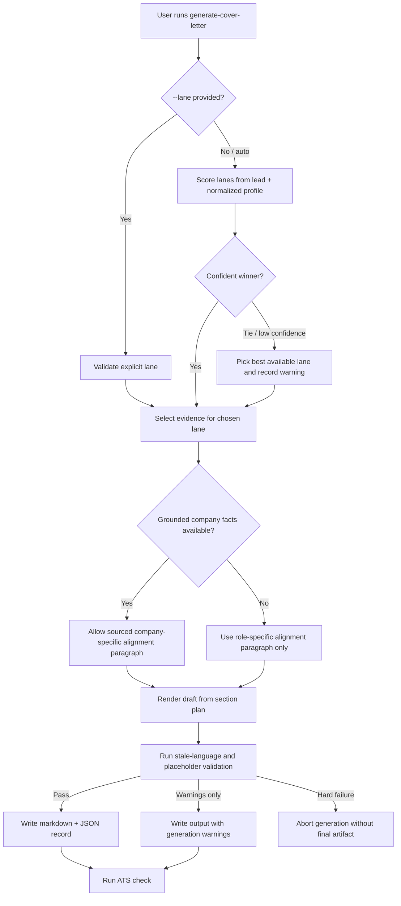

# feat: Improve Cover-Letter Generation With Strength Lanes and Safer Job-Specific Grounding

## Overview

Upgrade the existing `generate-cover-letter` pipeline so it can produce stronger, less formulaic letters that still preserve the repo's existing safety model and artifact flow.

The current generator is already integrated with:

- `generate-cover-letter` CLI dispatch in `src/job_hunt/core.py`
- generated content records in `schemas/generated-content.schema.json`
- normalized candidate profile inputs in `profile/normalized/candidate-profile.json`
- ATS post-checking in `src/job_hunt/ats_check.py`
- downstream application prep via `cover_letter_content_id`

The goal is to **build on that pipeline**, not replace it.

This plan introduces three first-class cover-letter "strength lanes" grounded in product-quality manual templates:

- `platform_internal_tools`
- `ai_engineer`
- `product_minded_engineer`

These lanes should improve differentiation, allow better job-role matching, and safely reuse richer profile inputs without fabricating company facts.

## Problem Statement

The current cover-letter generator in `src/job_hunt/generation.py` is functional but thin:

- it assembles a fixed four-paragraph letter with one generic tone
- it records `variant_style: "default"` and has no multi-style model
- it only draws from `skills` and `experience_highlights`
- it does not systematically use stronger candidate-authored material already present in:
  - `question_bank`
  - `preferences`
  - project notes such as `profile/raw/job-hunt.md`
  - project notes such as `profile/raw/ai-company-os.md`
- it produces weak company-specific prose when research is sparse
- it lacks guardrails against stale company-specific language from old raw cover letters or application answers

The result is a reliable but formulaic output that underuses the candidate's strongest narratives and does not clearly adapt to different role families.

## Goals

- Preserve the existing CLI, generated artifact, ATS, and downstream application workflow.
- Support multiple cover-letter lanes without inventing a parallel system.
- Make letters more job-specific through better evidence selection, not speculative company praise.
- Reuse grounded candidate raw materials safely.
- Add guardrails against stale placeholders and copied company-specific language.
- Ship a minimal first slice that is meaningfully better before introducing heavier profile-schema changes.

## Non-Goals

- No freeform LLM-only generation path detached from the normalized profile.
- No requirement to add company-web research beyond the existing `company_research` input.
- No attempt to support arbitrary style creation by end users in v1.
- No implementation in this planning task.

## Current Repeatable Pipeline

The following pieces are already repeatable and should remain the backbone:

1. `core.py` reads lead/profile/company inputs and calls `generation.generate_cover_letter(...)`.
2. `generation.py` selects matched skills and accomplishments from the normalized profile and writes:
   - markdown output
   - generated-content JSON
3. The content record already includes:
   - `content_id`
   - `content_type`
   - `variant_style`
   - `source_document_ids`
   - `selected_accomplishments`
   - `selected_skills`
   - `output_path`
   - `provenance`
4. `ats_check.run_ats_check_with_recovery(...)` already attaches ATS status to the content record.
5. Application prep can already attach generated cover-letter content by `cover_letter_content_id`.

## Relevant Learnings To Carry Forward

The implementation should explicitly follow these documented repo learnings:

- `docs/solutions/workflow-issues/harden-profile-normalization-signal-selection.md`
  - Treat candidate inputs as trust-tiered sources, not one undifferentiated text pool.
  - Prefer normalized candidate-facing signals over freeform raw-document mining.
- `docs/solutions/workflow-issues/promote-profile-source-updates-before-resume-and-cover-letter-targeting.md`
  - Improve reusable profile sources first; do not solve quality gaps by making one-off final-artifact edits.
  - Stale company-specific answer cleanup is part of the source-of-truth workflow, not only an output concern.
- `docs/solutions/workflow-issues/ship-tolerant-consumers-before-strict-producers.md`
  - New cover-letter metadata fields must land as optional producer output before downstream consumers depend on them.
- `docs/solutions/workflow-issues/extend-cli-with-new-modules-without-breaking-backward-compat.md`
  - New CLI flags and schema fields should preserve backward compatibility.
  - Existing artifacts must continue validating when lane metadata is absent.
- `docs/solutions/security-issues/design-secret-handling-as-a-runtime-boundary.md`
  - Treat sensitive/trust-boundary concerns as explicit runtime rules with test coverage, not just prose guidance.
  - The same pattern applies here for unsupported company facts and stale-company leakage: define the boundary and verify it.
- `docs/solutions/workflow-issues/review-deepened-plans-before-implementation.md`
  - Multi-pass plan lifecycles accumulate prose, code blocks, and schema fragments that must stay synchronized; catch contradictions at plan-edit time, not code-review time.
  - This plan went through multi-agent deepening and review; the reconciliation pass on 2026-04-18 pinned numeric constants, collapsed the schema surface, and resolved tolerant-consumer sequencing before Phase 0 starts.
- `docs/solutions/workflow-issues/reconcile-plan-after-multi-agent-deepening-review.md`
  - Prose simplification decisions must propagate into code blocks, schema blocks, test names, and deliverable checklists atomically — not serially.
  - When editing this plan further, batch decisions first, then propagate across all five surfaces in one pass per domain.
- `docs/solutions/security-issues/human-in-the-loop-on-submit-as-tos-defense.md`
  - Generation is safe to fully automate; downstream application *submission* remains human-gated.
  - This plan only changes generation; the application-prep / submit boundary in `src/job_hunt/application.py` is unaffected and must stay human-gated.

## Grounding Contract

This feature should be explicit about what remains grounded versus synthesized.

### Grounded Inputs

- `lead.title`
- `lead.company`
- `lead.normalized_requirements.keywords`
- `lead.normalized_requirements.required`
- optional fetched JD text already stored on the lead
- optional `company_research` facts such as:
  - `industry`
  - `tech_stack`
  - `remote_policy`
  - `notes`
- candidate profile facts from normalized data:
  - `experience_highlights`
  - `skills`
  - `question_bank`
  - `preferences`
  - `documents`

### Synthesized Output

- paragraph structure
- connective sentences
- lane-specific voice and emphasis
- summary phrasing that links grounded evidence to the role

### Never Fabricate

- company mission, values, customers, or product details not present in the lead or company research
- enthusiasm for a company-specific fact that is not actually sourced
- stale company names or prior-application specifics from raw source material

## Weaknesses To Address

### Generator Weaknesses

- Hardcoded single style in `generate_cover_letter(...)`
- Weak opening logic
- Generic closing logic
- Very limited use of normalized profile data
- No lane selection or rationale
- No section-level provenance or evidence plan

### Data Model Weaknesses

- `generated-content.schema.json` has only coarse cover-letter metadata
- no cover-letter lane identifier beyond the overloaded `variant_style`
- no explicit record of which question-bank answers or project notes were used
- no warnings field for stale-language or weak-grounding issues
- no structured section plan to inspect how the final prose was built

### Quality Guardrail Weaknesses

- ATS check does not detect unresolved placeholders like `[Company]`
- ATS check does not detect mismatched company names from stale source material
- ATS check does not distinguish grounded role-specific writing from unsupported company-specific writing

## Current Code Findings That Shape The Plan

The current implementation has a few concrete behaviors that the plan should correct directly:

- `src/job_hunt/generation.py` only uses `experience_highlights`, `skills`, and `preferences`; it does not use `question_bank` at all for cover letters.
- `generate_cover_letter(...)` currently falls back to "I am drawn to the mission of {company}" when `company_research` is present but thin. That is an unsafe default because it upgrades missing facts into company-specific praise.
- The current record writes only coarse provenance and the first few document ids, which is not enough to audit where lane-specific language came from.
- `src/job_hunt/ats_check.py` currently checks salutation, length, and keyword coverage only; it does not protect against placeholder leakage, stale company names, or unsupported company-specific claims.
- The raw source corpus already contains stale company-specific language such as `SpaceX` in `profile/raw/cover-letter.txt` and `Kadince`-specific answers in `profile/raw/question-examples.txt`, so reuse must be bounded by design rather than by convention.

## Reference Inputs To Learn From

Treat these manual templates as quality references, not copy-paste sources:

- `data/generated/cover-letters/kashane-platform-internal-tools-template-2026-04-17.md`
- `data/generated/cover-letters/kashane-ai-engineer-template-2026-04-17.md`
- `data/generated/cover-letters/kashane-product-minded-engineer-template-2026-04-17.md`

Key raw profile sources to reuse carefully:

- `profile/raw/Kashane Sakhakorn Resume.txt`
- `profile/raw/accomplishments.md`
- `profile/raw/question-examples.txt`
- `profile/raw/preferences.md`
- `profile/raw/ai-company-os.md`
- `profile/raw/job-hunt.md`
- `profile/raw/cover-letter.txt`
- `profile/raw/cover-letter2.txt`

## Proposed Solution

Refactor cover-letter generation into a lane-aware composition pipeline while preserving the current CLI and generated-content flow.

### New Internal Shape

Split the current single function into three pure helpers plus two pure detection helpers:

- `choose_cover_letter_lane(...)` — lane scoring + selection
- `select_cover_letter_evidence(...)` — evidence filtering for the chosen lane
- `render_cover_letter_markdown(...)` — section planning + markdown rendering (combined in v1)
- `find_unresolved_placeholders(...)` and `find_stale_company_mentions(...)` — pre-write guardrail detection, reused by `ats_check.py`
- `generate_cover_letter(...)` remains the public orchestration entrypoint

Do **not** introduce separate `build_cover_letter_sections` / `render_cover_letter` seams in v1 — combine them until a second renderer exists.

### Repo-Fit Python Implementation Shape

The repo already has a clear pattern: keep public entrypoints stable, keep `core.py` thin, and prefer extending an existing domain module before adding a new sibling module for a feature that still has a single public surface.

Recommended shape:

- keep `generate_cover_letter(...)` in `src/job_hunt/generation.py` as the stable public function used by `core.py` and existing tests
- add private cover-letter helpers inside `src/job_hunt/generation.py` for the first slice
- keep `src/job_hunt/ats_check.py` as a downstream validation consumer only
- keep `core.py` limited to CLI parsing and lazy-import dispatch

That preserves the current pipeline while avoiding a parallel system. If the helper cluster later becomes large enough to justify extraction, the repo can move it into a dedicated module after the lane model is proven.

### Recommended Module Boundary

Recommended responsibilities by file:

- `src/job_hunt/generation.py`
  - keep the public `generate_cover_letter(...)` entrypoint
  - keep all first-slice cover-letter helpers private to the module
  - compute `lead_keywords`
  - build a `document_id -> document metadata` index from `candidate_profile["documents"]`
  - perform lane selection, evidence selection, section planning, and markdown rendering
  - assemble the generated-content record
  - write markdown/json artifacts
- `src/job_hunt/cover_letter_generation.py`
  - not recommended for the first slice
  - **concrete extraction trigger**: if after Phase 1 the cover-letter-specific helpers + constants + `CoverLetterLaneSpec` in `generation.py` exceed roughly 400 lines or 8 top-level functions (current file is 545 lines mixing three content types), open a follow-up to extract them to `cover_letter_generation.py` and leave a re-export shim. Do not defer indefinitely.
- `profile/normalized/candidate-profile.json`
  - remain the only first-slice profile input surface consumed by generation
  - provide `documents` metadata for project-note-aware filtering without additional filesystem reads
- `src/job_hunt/ats_check.py`
  - document validation only
  - placeholder, stale-name, and unsupported-company-fact checks at the artifact level

### Shared Helper Guidance

Be conservative about extraction. The repo does not need a new generic "generation engine."

- Prefer passing `lead_keywords` and already-selected inputs into the cover-letter module rather than building a framework around shared mutable state.
- If a helper is only used by cover-letter code, keep it as a private helper in `generation.py` in the first slice.
- If a small text/token scoring helper is genuinely needed by more than one module, extract only that helper to a tiny neutral module.
- Prefer a small amount of duplication over cyclic imports or premature abstractions.

### Internal Types, Naming, and Typing Expectations

Use explicit internal types only where they earn their keep in v1. Keep the lane config strongly typed; keep everything else as plain dicts/tuples until a second consumer justifies further structure.

V1 internal shapes:

- `CoverLetterLaneId = Literal["platform_internal_tools", "ai_engineer", "product_minded_engineer"]`
- `@dataclass(frozen=True) class CoverLetterLaneSpec` — static lane config (preferred keywords, phrases, document allowlist, tone notes)

Defer to later slices (do not introduce in v1):

- `CoverLetterEvidence`, `CoverLetterSection`, `CoverLetterPlan` — for v1, pass evidence as a `dict[str, list[str]]` bucket and section plan as a `list[tuple[str, str, list[str]]]` of `(section_name, prose, source_document_ids)`. Promote to dataclasses only when a second consumer (analytics, fragment layer) actually reads them.

Dataclass visibility rule:

- `CoverLetterLaneSpec` is module-level and importable by tests (no leading underscore), matching the `AnswerResolution` precedent in `src/job_hunt/answer_bank.py`.
- If later dataclasses get added, they follow the same convention — no `_CoverLetterPlan` style private dataclasses, because the helper-level tests must reach them.

Naming expectations:

- `choose_cover_letter_lane(...)` instead of `pick_style(...)`
- `select_cover_letter_evidence(...)` instead of `collect_data(...)`
- `render_cover_letter_markdown(...)` returns final markdown text (combines section planning + rendering in v1)
- `find_stale_company_mentions(...)` instead of generic names like `validate_text(...)`
- `find_unresolved_placeholders(...)` for the placeholder detection helper

Typing expectations:

- all new functions should have parameter and return annotations
- use modern Python syntax such as `str | None`, `list[str]`, and `dict[str, str]` (repo is Python >=3.11 per `pyproject.toml`)
- use `Final` for lane ids, thresholds, and regexes (raises the bar above the current unadorned `STYLE_*` constants in `generation.py`; that is intentional)
- keep the lane spec internal as a frozen dataclass; convert to plain dicts only at the JSON write boundary
- serialization follows the `discovery.py` convention: explicit `to_dict()` methods on dataclasses, not `dataclasses.asdict()`. See `src/job_hunt/discovery.py:96` — *"Data types — explicit to_dict so schemas align with runtime shape."*

Helper decomposition expectations inside `generation.py` (v1 target: three seams, not five):

- keep `generate_cover_letter(...)` as orchestration only
- `choose_cover_letter_lane(...)` — pure helper that scores lanes and returns `(lane_id, lane_source, rationale, warnings)`
- `select_cover_letter_evidence(...)` — pure helper that filters accomplishments, skills, question-bank entries, and allowlisted project-note doc ids for the chosen lane
- `render_cover_letter_markdown(...)` — pure helper that both builds the section plan and emits markdown (combined for v1; split later if a second renderer appears)
- `find_unresolved_placeholders(...)` and `find_stale_company_mentions(...)` — pure detection helpers at module scope in `generation.py`, imported by `ats_check.py` for Phase 3 (see "Detection Helper Ownership" below)
- profile-document indexing is a one-line dict comprehension — inline at the call site, do not extract a helper
- keep filesystem writes and record assembly at the public entrypoint boundary

### Keep Grounded Selection Separate From Rendered Prose

The cleanest internal seam for v1 is three steps, not five:

1. choose lane (returns lane id + rationale + warnings)
2. select evidence (returns evidence bucket dict keyed by role: opening/proof/alignment/closing)
3. render markdown from the evidence bucket (internally builds and emits; split later if warranted)

Pre-write guardrails run after (3) and before artifact write — they are not a separate "seam" in the selection pipeline, they are a terminal validation gate.

This is easier to test and extend than a single function that both chooses evidence and emits final prose, without paying for speculative `Plan` / `Section` object models in v1.

### Lane Model

Introduce three first-class lane constants:

- `COVER_LETTER_LANE_PLATFORM_INTERNAL_TOOLS`
- `COVER_LETTER_LANE_AI_ENGINEER`
- `COVER_LETTER_LANE_PRODUCT_MINDED_ENGINEER`

Each lane should define:

- preferred lead keywords / phrases
- preferred evidence sources
- tone emphasis
- preferred project-note signals
- preferred closing framing

### Lane Selection

Lane selection should support both:

- explicit override from CLI
- automatic selection when no override is provided

Auto-selection should score lanes using:

- lead title tokens
- requirement keywords
- required skills
- overlap with lane-specific phrases
- overlap with project-note tags and normalized skills

The content record should store:

- chosen lane
- whether the lane was auto-selected or explicitly requested
- a short rationale string

Compatibility rule:

- `variant_style` should continue to be written and should store the resolved lane id, never the literal CLI input `auto`

## Job-Specificity Strategy

Job-specificity should come from **better evidence selection**, not speculative company personalization.

### Section Strategy

1. Opening
   - reference the role and company name
   - establish the strongest lane-appropriate narrative
   - stay role-specific unless company facts are actually available

2. Proof paragraph
   - use the strongest accomplishment for the lane and lead
   - pull one or two matched technologies or responsibilities
   - preserve measurable details when grounded

3. Alignment paragraph
   - if `company_research` has strong facts, use only those facts
   - otherwise focus on role fit, work style, domain fit, or system/problem fit

4. Closing
   - summarize lane-specific value proposition
   - keep it brief and grounded

### Safe Company-Specific Rules

- Allow company-specific language only when supported by `lead` or `company_research`.
- Prefer "This role stands out because..." when research is sparse.
- Avoid "mission", "vision", "culture", or "your product" language unless sourced.

## Raw Material Reuse Strategy

Treat source materials as different trust tiers with different allowed uses.

### Trust Tiers

1. Tier 1: lead and company research
   - trusted for role title, company name, requirements, and explicit company facts
   - the only allowed source for company-specific language
2. Tier 2: normalized candidate profile
   - trusted for candidate facts, accomplishments, preferences, and reusable question-bank answers
   - primary source for v1 evidence selection
3. Tier 3: allowlisted project-note documents
   - trusted only for candidate-authored project narratives after explicit allowlisting
   - v1 should limit this to known documents such as `job-hunt` and `ai-company-os`
4. Tier 4: raw cover letters, manual templates, and freeform question-example prose
   - reference-only inputs for offline extraction, normalization, and tests
   - not safe as direct render sources in the first implementation slice

### Reuse Rules

- Candidate claims may be synthesized from Tier 2 and Tier 3 sources.
- Company-specific claims may only be synthesized from Tier 1 sources.
- Raw cover-letter paragraphs and freeform company-answer prose should not be copied directly into a generated letter in v1.
- Question-bank reuse in v1 should favor generic prompts such as role interest, project highlights, work style, and impact; entries tied to a specific company, value set, or prior application prompt should be filtered out before selection.
- Any later structured fragment extracted from Tier 4 must carry:
  - `source_document_id`
  - `source_excerpt` or equivalent inspectable provenance
  - `candidate_fact_only: true|false`
  - `company_specific_risk: none|low|high`
  - `reusable_for_generation: true|false`

### Minimal Slice

Use already-normalized data only:

- `experience_highlights`
- `skills`
- `question_bank`
- `preferences`

Use normalized document metadata to identify project-note-backed evidence:

- `job-hunt`
- `ai-company-os`

Implementation note:

- v1 should not read `profile/raw/*` or `profile/normalized/documents/*.json` directly from `generation.py`
- instead, it should map `source_document_ids` from selected highlights / question-bank entries back to `candidate_profile["documents"]`
- that keeps the generator deterministic, testable, and aligned with the current pipeline

This avoids a new normalization pass in the first implementation.

### V1 Scope Recommendation For Project Notes

The repo's normalization learnings point the same direction: trust-bounded signals should beat freeform raw-document mining.

Recommendation:

- use normalized profile fields first: `experience_highlights`, `skills`, `question_bank`, `preferences`
- allow only a tiny, explicit allowlist of project-note signals in v1
- do **not** scan arbitrary raw files during cover-letter generation in the first slice

If project-note text is needed for lane differentiation, it should come from already-known document ids/titles or a small preselected note corpus, not from reopening the whole raw profile tree at render time.

### Later Slice

Extend profile normalization to produce reusable `cover_letter_fragments` or `narrative_fragments` with metadata such as:

- `fragment_type`
- `lane_affinities`
- `source_document_ids`
- `source_excerpt`
- `stale_company_risk`
- `company_specific_risk`
- `candidate_fact_only`
- `reusable`

This gives the generator a safer structured source than mining raw freeform documents directly at generation time.

## User and System Flows

This section deepens the plan around the main runtime permutations another implementation agent will need to handle deliberately rather than infer.

### User Flow Overview



1. Auto lane selection, no company research
   - User runs `generate-cover-letter` with no `--lane` or `--lane auto`.
   - System scores the three lanes from lead title, requirement keywords, required skills, and normalized profile overlap.
   - System renders a role-specific letter without unsupported company praise.
   - Content record stores lane, auto-selection rationale, and any low-confidence warning.

2. Explicit lane override
   - User runs `generate-cover-letter --lane <lane_id>`.
   - System respects the explicit lane if valid.
   - System still computes the auto lane in the background for comparison and debugging.
   - If explicit override strongly disagrees with auto scoring, system records a warning but does not silently change the requested lane.

3. Generation with usable company research
   - User provides `--company`.
   - System extracts only grounded fields from company research and lead data.
   - Alignment paragraph may mention sourced industry, tech stack, or operating context.
   - Content record stores which company facts were actually used, not just that research was present.

4. Generation with missing, sparse, or unusable company research
   - User omits `--company`, or research exists but has no facts safe to use.
   - System falls back to role-specific fit language.
   - This is a normal path, not an error.
   - Content record encodes this via `company_facts_used`: omitted/null when `--company` was absent, empty list when research was present but unusable, populated list otherwise (see "Schema Evolution").

5. Stale raw-source material present during first-slice generation
   - Raw cover-letter and question-bank materials may contain old company names, placeholders, or one-off application phrasing.
   - First slice should not mine raw cover-letter files directly at generation time.
   - System should prefer normalized profile fields plus a small allowlist of project-note inputs.
   - Post-render validation checks the final output for stale names and placeholder leakage before the artifact is finalized.

6. Future normalized fragment extraction
   - A later normalization pass derives reusable narrative fragments from raw documents into structured profile data.
   - Fragment extraction is offline and reviewable; generation consumes structured fragments rather than scraping raw files on demand.
   - Fragment metadata must include source ids, lane affinities, reusability, and stale-company risk.
   - Generation prefers low-risk fragments by default and excludes high-risk fragments unless explicitly reviewed or downgraded.

7. Warning and failure flow
   - Warning-only conditions still allow artifact creation and ATS checks.
   - Hard failures stop before final artifact write so the repo does not store obviously broken outputs as if they were valid drafts.
   - The plan must define which conditions are warnings versus hard failures up front.

### Flow Permutations Matrix

| Flow | Lane input | Company research | Source layer | Expected system behavior | Severity |
|------|------------|------------------|--------------|--------------------------|----------|
| A | `auto` | none | normalized profile only | choose highest-scoring lane, render role-specific alignment paragraph, record rationale | success |
| B | explicit valid lane | none | normalized profile only | honor explicit lane, render chosen lane, record override source | success |
| C | `auto` | usable facts present | normalized profile + company research | use sourced company facts only in alignment paragraph and metadata | success |
| D | explicit valid lane | research present but unusable | normalized profile + research metadata | ignore unsupported company facts, fall back to role-specific phrasing, record warning if helpful | success or warning |
| E | `auto` | none | stale raw docs exist in repo | ignore raw cover-letter docs in first slice, validate output for stale leakage | success or warning |
| F | explicit valid lane | none | evidence too weak for chosen lane | honor explicit lane, reduce specificity, record weak-evidence warning | warning |
| G | `auto` | none | best lane tied or low confidence | choose best available lane with deterministic tiebreaker, record low-confidence warning | warning |
| H | any | any | rendered output contains `[Company]` or `[Role]` | abort before final write | hard failure |
| I | any | any | rendered output leaks wrong company name | abort before final write; ATS hard-error backstop if it somehow escapes | hard failure |
| J | future fragment flow | any | normalized fragments include high stale-company risk | skip fragment by default, record exclusion reason | success or warning |
| K | invalid | any | normalized profile only | hard-fail with `invalid_lane_id` before any selection or rendering work | hard failure |
| L | `auto` | none | empty candidate profile (no highlights, no question-bank, no skills) | hard-fail with non-coded "zero grounded evidence" — no draft artifact written | hard failure |
| M | any | any | lead missing `title` or `company` | hard-fail before rendering, propagate underlying error | hard failure |
| N | `auto` | none | `lead.normalized_requirements` missing entirely | treat requirement keywords as empty set, score lanes on title tokens only, record `lane_low_confidence` warning | warning |
| O | `auto` | present | `company_research.company_name` disagrees with `lead.company` | prefer `lead.company` for rendering and denylist checks, drop the conflicting company_research facts, record `lane_low_confidence` warning with `detail: "company_research name mismatch"` | warning |

### Decision Rules To Lock Down

#### Lane selection contract

- Auto-selection should be deterministic for the same lead/profile inputs.
- If two lanes tie, use a documented tiebreaker:
  - prefer the lane with stronger accomplishment evidence
  - then prefer the lane with stronger project-note evidence
  - then fall back to a stable lane priority order
- If the winning lane score is below a defined confidence threshold, still generate a letter but emit a low-confidence warning.
- Explicit lane override should win over auto-selection unless the lane id is invalid.

#### Evidence-selection fallback contract

- In auto mode, if the top-scoring lane lacks enough grounded evidence after filtering, the generator may fall back to the next-best lane and record a fallback warning.
- In explicit mode, do not silently switch lanes. Keep the requested lane, reduce specificity if needed, and record `weak_lane_evidence`.
- The minimal slice should define a minimum evidence bar such as:
  - at least one accomplishment or project-note proof point
  - at least two matched skills or requirement overlaps

#### Company-fact contract

- Treat `lead` and `company_research` as separate inputs.
- Use company facts only when the fact text is present and attributable.
- If lead and company research conflict, prefer lead-derived facts and record a warning in metadata.
- Absence of usable company facts is not a failure case.

#### Stale-source contract

- First slice generation should never directly quote or select from `profile/raw/cover-letter*.txt`.
- Later fragment extraction may read those files, but extracted fragments must be tagged with `stale_company_risk`.
- Wrong-company names detected in output are hard failures in the first slice.
- Unresolved placeholders are hard failures in the first slice.

### Warning and Failure Taxonomy

#### V1 warning-level codes (3)

- `lane_low_confidence` — generic v1 soft-warn bucket. Primary use: winning lane score below threshold or top-2 margin too narrow. Also reused for adjacent soft warnings in v1 (e.g., `company_research` / `lead.company` name mismatch in flow O, explicit override disagreeing with auto pick) via the `detail` string. This bucket is intentionally overloaded in v1 so we do not reserve dedicated codes before use cases are real; split into distinct codes in a later slice if `detail` strings become load-bearing for downstream consumers.
- `weak_lane_evidence` — evidence bar (see below) met at minimum but not comfortably
- `stale_name_filtered` — a known stale company name was detected in candidate inputs and filtered before rendering

#### V1 hard-failure codes (3)

- `invalid_lane_id` — explicit `--lane` value is not one of the three known lane ids
- `unresolved_placeholder` — final rendered text contains `[Company]`, `[Role]`, or similar unbound placeholder tokens
- `wrong_company_name` — final rendered text mentions a non-target company name from the stale-name denylist

#### Intentionally deferred codes

Not wired in v1; revisit after the core slice ships and real cases exist:

- `lane_override_differs_from_auto` — v1 policy: always warn-never-fail silently. Emit as a `lane_low_confidence` entry with `detail: "explicit override conflicts with auto pick"`, or defer the dedicated code entirely.
- `company_research_unused` — derivable from `company_facts_used` being empty when `--company` was provided; no dedicated warning in v1.
- `unsupported_company_fact_dropped` — relies on a heuristic matcher; defer to the ATS-warning tier until the deterministic matcher rule (see "Phase 1 Concrete Constants") proves reliable.
- `fragment_skipped_high_stale_risk` — Phase 5 concern; do not reserve the code in v1.

#### Additional v1 hard-failure conditions (non-coded)

These abort before final artifact write but do not need dedicated warning codes:

- missing `lead.title` or `lead.company` required for rendering (propagate the underlying error)
- zero grounded evidence remaining after required filtering (see zero-evidence rule in "Phase 1 Concrete Constants")
- schema write failure or inability to persist the content record

Hard failures abort before final artifact write. Temporary render output for debugging must be written outside the normal generated-content happy path so downstream consumers do not treat it as a valid draft.

Warning entries in `generation_warnings` use the shape `{code, severity: "warning", detail}`; hard failures surface as raised exceptions with `code` attached, not as artifact entries.

## Stale-Language Guardrails

Add explicit detection before writing the final letter.

### Guardrail Checks

- unresolved placeholders such as `[Company]` or `[Role]`
- mentions of company names not equal to the current lead company
- known stale names from prior application material when they appear in the output
- company-specific praise not supported by lead or company research

### Trust-Boundary Policy

- Treat raw cover letters, question examples, and manual templates as untrusted for company-specific prose.
- They may contribute candidate-side narrative shape only after extraction into structured fragments or explicit tests.
- If a sentence mentions the target company together with unsupported concepts like mission, vision, culture, customers, or product, the generator should assume the sentence crosses the company-fact boundary unless it can point to `lead` or `company_research` support.

### Enforcement

Use multiple enforcement points rather than relying on ATS alone.

#### Generation-Time Hard Stops

- unresolved placeholders such as `[Company]` or `[Role]`
- final-output mentions of a non-target company name from a maintained stale-name denylist
- company-specific claims generated without Tier 1 support when the claim matcher is deterministic

These should fail generation before the markdown artifact is accepted as usable.

#### ATS Hard Errors

- placeholder leakage that somehow bypassed generation-time validation
- stale non-target company name leakage that bypassed generation-time validation

These are deterministic trust failures, not advisory quality concerns.

#### ATS Warnings

- unsupported company-specific language detected by heuristics rather than deterministic fact matching
- overly generic alignment paragraphs with no concrete evidence
- weak evidence density
- forced role-specific fallback when company facts were unavailable

ATS is the right place for soft quality signals and heuristic suspicion, but not the only line of defense for hard trust-boundary violations.

### Unsupported Company-Fact Handling

When the generator wants to express company alignment, it should choose one of three paths:

1. Use a sourced company fact from `lead` or `company_research`.
2. Fall back to role-specific language tied to responsibilities, systems, or domain.
3. Omit the company-specific clause entirely.

It should never invent a fourth path by inferring mission, customers, culture, or product details from tone alone.

## Schema Evolution

Per the repo's tolerant-consumer pattern, add optional fields before making any consumer depend on them.

### `generated-content.schema.json`

Keep existing required fields. Add **seven** optional fields for v1 (collapsed from an earlier 11-field draft):

- `lane_id` — resolved lane id
- `lane_source` — `"auto" | "explicit"`
- `lane_rationale` — short human-readable string (numeric score summaries go in a debug sidecar, not every artifact)
- `selected_question_bank_questions` — list of question-bank prompts actually pulled into the letter
- `company_facts_used` — list of `{source: "lead" | "company_research", field, value}` entries; absence (`null`/omitted) means no company-specific facts were used
- `generation_warnings` — single unified list of `{code, severity, detail}` entries covering lane warnings, trust-boundary soft signals, and evidence-quality signals
- (`variant_style` continues to be written, mirroring the resolved lane id, for compatibility)

Intentionally **deferred** (do not add in v1):

- `lane_auto_score_summary` — useful for debugging once, dead weight in every artifact. Emit only into a separate debug sidecar file when `--debug-lane-scoring` is passed. Add to the schema only when a consumer needs it.
- `selected_project_note_ids` — subsumed by upgrading `source_document_ids` to reflect actual evidence sources.
- `company_research_provided` — derivable from `company_facts_used` (null vs empty list vs populated).
- `trust_boundary_flags` — overlaps with `generation_warnings` codes like `unsupported_company_fact_dropped`. Keep the single warning list to avoid producers having to populate two parallel signals.
- `lane_warnings` as a separate list — merged into `generation_warnings` with codes like `lane_low_confidence`, `lane_override_differs_from_auto`, `weak_lane_evidence`.

First-slice schema guidance:

- keep the first metadata expansion flat — no nested `section_plan` persistence until a second slice proves it is essential
- make `source_document_ids` reflect the actual evidence used in the generated letter rather than the current coarse "first few documents" approximation
- all seven new fields are optional; records written before this slice continue to validate

### Later `candidate-profile.schema.json` Extension

Potential later optional field:

- `cover_letter_fragments`

This should land only after tolerant consumers exist.

## Phase 1 Concrete Constants

These are the numeric and format decisions that Phase 1 must lock in before implementation. Prose in earlier sections references them; this section is the single source of truth.

### 1. Lane scoring formula

Reuse the resume variant shape already in `src/job_hunt/generation.py` so the repo has one scoring idiom:

```
lane_score = 0.7 * jaccard(combined_tokens, lead_keywords) + 0.3 * phrase_boost
```

Where:

- `combined_tokens = generation_tokens(lead.title) | lead.normalized_requirements.keywords | lead.normalized_requirements.required`
- `phrase_boost` is `min(phrase_hits / max(len(lane_phrases), 1), 1.0)` over the lane's preferred phrase list (mirrors `select_accomplishments_for_variant`)
- lane-specific phrase lists live on `CoverLetterLaneSpec.preferred_phrases`

Skill overlap and project-note overlap enter as **evidence filters** in `select_cover_letter_evidence(...)`, not as additional scoring dimensions, to keep the scoring formula matched to the existing resume code path.

### 2. Confidence threshold

Two numeric checks, both must pass for the auto-selected lane to be considered "confident":

- absolute winning score `>= 0.15`
- top-2 margin `>= 0.05`

If either fails, emit a `lane_low_confidence` warning but still proceed with the winner (per flow G). Thresholds are `Final`-annotated module constants; they can be tuned by editing and re-running `tests/test_cover_letter_lanes.py`.

### 3. Tiebreaker priority

When two lane scores are equal within a tolerance of `0.001`, use this deterministic order (most-to-least preferred):

1. `platform_internal_tools`
2. `ai_engineer`
3. `product_minded_engineer`

This priority is a single module-level `Final` tuple; tests assert the order is preserved.

### 4. Minimum evidence bar and zero-evidence behavior

A lane's evidence bundle is "sufficient" when it has:

- at least 1 accomplishment from `experience_highlights` with nonzero lead-keyword overlap, OR at least 1 allowlisted project-note document id (the second source covers newer candidates with thin highlights)
- AND at least 2 matched skills OR at least 1 matched requirement keyword from the lead

Behavior when the bar is not met:

- **auto mode**: fall back to the next-best-scoring lane; if every lane fails the bar, raise the non-coded "zero grounded evidence" hard failure (flow L).
- **explicit mode**: honor the requested lane, emit `weak_lane_evidence` warning, and continue; do not silently switch lanes. If the explicit lane has *zero* evidence on all dimensions, raise the same hard failure — better to abort than to ship an empty letter.

### 5. Stale-name denylist

- Denylist is a module-level constant `STALE_COMPANY_DENYLIST: Final[frozenset[str]] = frozenset({"SpaceX", "Kadince"})` in `generation.py`.
- Adding a name is a code change, reviewed like any other — no dynamic file loading in v1. Simpler to reason about and keeps the guardrail deterministic.
- **False-positive escape hatch**: `find_stale_company_mentions(text, target_company, denylist)` skips any name equal (case-insensitive) to `target_company`, so legitimate targeting of a denylisted company as the actual lead still works. Additionally, the match requires whole-word boundaries (`\b`) to avoid substring false positives (e.g., "kadince.com" in a URL fragment would match, but "arcade" would not).
- Candidate's own prior employers in `experience_highlights` are not denylisted — the list is for stale *target-company* leakage from raw cover letters, not for the candidate's resume history.

### 6. Deterministic unsupported-company-fact matcher

The v1 generator does not emit unsupported company-fact sentences at all, because it only uses the evidence selected in `select_cover_letter_evidence(...)` — which only sources company-specific phrasing from `lead` and `company_research`. Therefore the **deterministic matcher is not needed in v1's generation path**.

For the ATS side (Phase 3), the deterministic matcher is scoped to a narrow check:

- flag any sentence that contains the lead.company name AND one of the nouns `{"mission", "vision", "culture", "customers", "product", "values"}`
- AND where none of the matched nouns appears as a substring of any value in `company_research`
- this is an ATS **warning**, not a hard failure; the hard failures remain placeholder leakage and wrong-company-name leakage

If the matcher proves too noisy in practice, the code for `company_research_unused` / `unsupported_company_fact_dropped` warnings can be added later.

### 7. `candidate_name` resolution gap

`preferences.candidate_name` does not exist in `profile/normalized/candidate-profile.json`. The current `generate_cover_letter` silently falls back to the string `"Candidate"`. Phase 1 does **not** fix this in the first slice — the lane refactor preserves the existing fallback to keep Phase 1 focused. The gap is tracked as a Phase 2 (or separate) task: either add `candidate_name` to the normalized profile or read it from `profile/raw/Kashane Sakhakorn Resume.txt` during normalization.

This is deliberately inconsistent with the "missing lead title or company name is hard failure" rule (flow M): the candidate name is *candidate-owned data* with an established fallback; lead fields come from an external source and cannot be meaningfully defaulted.

## Implementation Phases

### Phase 0: Tolerant ATS Reader (prerequisite) ✅

Per `docs/solutions/workflow-issues/ship-tolerant-consumers-before-strict-producers.md`, the consumer must land before the producer writes new fields. This phase is small but non-skippable.

- [x] Teach `src/job_hunt/ats_check.py` and any reporting consumers to read the new `generation_warnings`, `lane_id`, `lane_source`, `lane_rationale`, `selected_question_bank_questions`, and `company_facts_used` fields *if present*, with safe defaults if absent.
- [x] No behavior change — Phase 0 only adds tolerant read paths; the producer still writes today's schema.
- [x] Add a regression test that existing generated-content records (without the new fields) continue to pass ATS and downstream consumers unchanged.
- [x] Commit Phase 0 separately so the tolerant-consumer ordering is visible in `git log`.

### Phase 1: Lane-Aware Generator Refactor

- Keep the entire first-slice lane pipeline inside `src/job_hunt/generation.py`.
- Keep `generate_cover_letter(...)` in `src/job_hunt/generation.py` as a thin orchestration wrapper.
- Add lane constants and scoring rules per "Phase 1 Concrete Constants" §1–§3.
- Add support for question-bank and project-note-aware evidence selection using already-loaded normalized profile data.
- Enforce the minimum evidence bar per §4, including the auto→fallback and explicit-mode-warn behavior.
- Add the stale-name denylist per §5.
- Write detection helpers at `generation.py` module scope: `find_unresolved_placeholders(text) -> list[str]` and `find_stale_company_mentions(text, target_company, denylist) -> list[str]` (see "Detection Helper Ownership" below).
- Add a pre-write validation gate that invokes both detection helpers; on any hit, raise hard-failure exceptions with `code` attached.
- Keep `generate_cover_letter(...)` as the public interface.
- Preserve current file-output contract.
- Add helper-level unit tests (lane selection, evidence selection, rendering, guardrail detection) before widening CLI or schema surfaces.
- Introduce only one internal frozen dataclass: `CoverLetterLaneSpec`. Evidence buckets and section plans remain plain dicts/tuples in v1.

### Phase 2: CLI and Metadata Wiring

- Extend `generate_cover_letter(...)` with an optional `lane` parameter before wiring the CLI flag.
- Add `--lane` option to `generate-cover-letter` in `src/job_hunt/core.py`
- support values:
  - `auto`
  - `platform_internal_tools`
  - `ai_engineer`
  - `product_minded_engineer`
- extend the generated-content record with the seven optional fields listed in "Schema Evolution" (`lane_id`, `lane_source`, `lane_rationale`, `selected_question_bank_questions`, `company_facts_used`, `generation_warnings`, plus the upgraded `source_document_ids`).
- record what was actually used from company research in `company_facts_used`; its presence/absence implicitly encodes whether research was provided and usable.
- continue writing `variant_style` as the resolved lane id.

### Phase 3: ATS and Safety Checks

- expand `check_cover_letter(...)` in `src/job_hunt/ats_check.py`
- **import the Phase 1 detection helpers from `generation.py`** rather than re-implementing regex logic — single source of truth (see "Detection Helper Ownership").
- add ATS hard errors (backstop for anything that escapes generation-time gates):
  - placeholder leakage (`find_unresolved_placeholders` returns non-empty)
  - wrong-company-name leakage (`find_stale_company_mentions` returns non-empty)
- add ATS warnings:
  - weak evidence density (heuristic on letter length vs matched-keyword count)
  - unsupported company-specific language (the deterministic matcher from §6)
  - forced role-specific fallback when company facts were unavailable (reads `company_facts_used` being null/empty while `--company` was provided)
- ATS warning codes align with `generation_warnings` codes where they overlap; the ATS layer emits additional codes for heuristic suspicion that generation-time cannot determine.
- no new consumer behavior on the new optional fields is required beyond reading them — Phase 0 already wired tolerant reads.

### Phase 3a: Stricter Expectations (deferred)

Once Phase 0→1→2→3 have shipped and real artifacts carry the new fields, a later slice may consider making `lane_id` or `generation_warnings` required for newly-generated artifacts. Not in scope for v1.

## Detection Helper Ownership

To avoid Phase 1 and Phase 3 duplicating regex logic:

- `find_unresolved_placeholders(text: str) -> list[str]` and `find_stale_company_mentions(text: str, target_company: str, denylist: frozenset[str]) -> list[str]` live in `src/job_hunt/generation.py` at module scope.
- They are pure functions with no I/O and no dataclass dependencies; they import nothing from `ats_check.py`.
- `ats_check.py` imports them from `generation.py` for its Phase 3 hard-error checks.
- This keeps ATS as a downstream consumer of `generation.py` (same direction as today's dependency graph) and avoids a third "shared" module for two small helpers.
- If a future module also needs them, extract to a tiny neutral module then — not pre-emptively.

### Phase 4: Prompt and Documentation Alignment

- update `prompts/generation/cover-letter.md`
- document lane behavior, grounding rules, and stale-language guardrails
- document no-research fallback language and explicit-override semantics

### Phase 5: Higher-Quality Normalized Fragment Layer

- extend normalization to extract reusable cover-letter fragments
- update candidate-profile schema
- route generation to prefer structured fragments over ad-hoc raw text reuse
- quarantine or mark extracted fragments with stale-company risk before they become generation inputs

## Minimal First Implementation Slice

This is the recommended first execution slice (Phase 0 + Phase 1 + Phase 2 + Phase 3).

- Phase 0 lands a tolerant ATS reader as a pure no-op so Phase 2's new fields are safe to write.
- lane-aware generator with three lanes.
- no new module in the first slice; keep the lane pipeline inside `generation.py` behind a small number of module-level helpers (`choose_cover_letter_lane`, `select_cover_letter_evidence`, `render_cover_letter_markdown`, plus two detection helpers).
- one frozen dataclass (`CoverLetterLaneSpec`); evidence buckets and section plans are plain dicts/tuples in v1.
- auto lane selection plus explicit override using the numeric constants in "Phase 1 Concrete Constants" (scoring formula, `0.15` absolute / `0.05` margin thresholds, tiebreaker priority).
- evidence selection from:
  - `experience_highlights`
  - `skills`
  - `question_bank`
  - allowlisted project-note document ids inferred from normalized document metadata
- minimum evidence bar: ≥1 accomplishment-or-project-note proof AND (≥2 matched skills OR ≥1 matched requirement keyword); auto mode falls back to next lane, explicit mode warns and continues.
- deterministic low-confidence warning and tie-breaking behavior.
- no direct generation-time reads from raw cover-letter files.
- seven optional generated-content fields (`lane_id`, `lane_source`, `lane_rationale`, `selected_question_bank_questions`, `company_facts_used`, `generation_warnings`, upgraded `source_document_ids`).
- `variant_style` preserved as the resolved lane id.
- three warning codes (`lane_low_confidence`, `weak_lane_evidence`, `stale_name_filtered`) and three hard-failure codes (`invalid_lane_id`, `unresolved_placeholder`, `wrong_company_name`) in v1.
- generation-time hard stops for placeholders, wrong-company-name leakage via module-level `find_unresolved_placeholders` and `find_stale_company_mentions`.
- stronger ATS coverage for hard trust failures plus soft grounding warnings, importing the same detection helpers from `generation.py`.

### First-Slice Acceptance Criteria

- `generate-cover-letter` can produce three materially distinct outputs for the same lead when lane is changed.
- `generate-cover-letter --lane auto` selects a sensible default lane for representative platform, AI, and product-minded leads.
- `generate-cover-letter --lane <lane>` honors the explicit lane even when auto-selection would differ, and the content record captures that mismatch as metadata.
- generation succeeds both with and without `--company`; when `--company` is absent or unusable, the alignment paragraph stays role-specific and does not invent company facts.
- lane auto-selection ties or low-confidence results are deterministic and recorded as warnings rather than silent randomness.
- generated letters do not contain `[Company]` or `[Role]` placeholders.
- generated letters do not leak known stale company names from raw profile materials.
- first-slice generation does not read raw `cover_letter` documents directly from `profile/raw/`; it relies on normalized fields and a documented allowlist of project-note inputs.
- company-specific prose in the final output can be traced back to `lead` or `company_research`.
- current ATS and application-prep flow still works without consumer breakage.

## Higher-Quality Follow-On Slice

- normalized `cover_letter_fragments`
- richer section-plan metadata
- more nuanced company-fact usage tracking
- stronger phrase-level provenance
- fragment extraction flow that tags stale-company risk and defaults to excluding risky fragments
- optional analytics on which cover-letter lanes correlate with better downstream outcomes

## Files Likely To Change

- `src/job_hunt/generation.py`
- `src/job_hunt/core.py`
- `src/job_hunt/ats_check.py`
- `src/job_hunt/profile.py` for the later slice
- `schemas/generated-content.schema.json`
- `schemas/candidate-profile.schema.json` for the later slice
- `prompts/generation/cover-letter.md`
- `tests/test_generation.py`
- `tests/test_ats_check.py`
- `tests/test_pipeline.py` if the full CLI plus ATS lifecycle needs end-to-end coverage

Potential new test/support files:

- `tests/test_cover_letter_lanes.py`
- fixtures for representative leads and stale-language cases

## Test Strategy

### Unit Tests

- lane scoring and selection
- explicit lane override
- deterministic tie-breaking and low-confidence warning behavior
- evidence selection from question bank and project notes
- company-fact usage only when sourced
- no-research fallback path
- stale-company detection helpers
- section-plan construction without rendering

### Test Organization Recommendation

Keep the tests aligned to module boundaries rather than feature marketing names.

- keep lightweight end-to-end `generate_cover_letter(...)` smoke tests in `tests/test_generation.py`
- add focused lane/evidence/rendering tests either in `tests/test_generation.py` or a new `tests/test_cover_letter_lanes.py`
- keep ATS-specific warnings and failure taxonomy in `tests/test_ats_check.py`
- keep schema-validation assertions where they already live unless the new file produces enough schema cases to justify a dedicated schema test

This matches the repo's existing flat `unittest` style and avoids turning `tests/test_generation.py` into a second god file.

### Suggested Test Class Layout

Inside the dedicated lane test file, prefer small `unittest.TestCase` classes grouped by behavior — one per helper seam, not per speculative planning object:

- `CoverLetterLaneSelectionTest` — covers `choose_cover_letter_lane` scoring, tiebreaker priority, confidence threshold
- `CoverLetterEvidenceSelectionTest` — covers `select_cover_letter_evidence` including the minimum evidence bar and auto→fallback behavior
- `CoverLetterRenderingTest` — covers `render_cover_letter_markdown` output structure and no-company-research fallback
- `CoverLetterGuardrailTest` — covers `find_unresolved_placeholders` and `find_stale_company_mentions` including the false-positive escape hatch

Use small shared builders like `_sample_profile()`, `_sample_lead()`, and one or two representative company-research fixtures rather than introducing a new fixture framework for this slice. These mirror the existing `tests/test_generation.py` pattern.

### Output-Shape Tests

- generated-content JSON still validates
- new optional fields do not break existing flows
- ATS report still writes correctly
- hard-failure paths do not leave a misleading final generated-content artifact behind

Add explicit compatibility tests for:

- records that omit all new lane metadata still validate
- records that include lane metadata also validate
- consumers that still rely on `variant_style` continue to work unchanged

### Quality Regression Tests

- generated letters differ across lanes in meaningful ways
- placeholder tokens are never emitted
- stale company names are detected
- role-specific fallback works when company research is missing
- explicit override mismatch records warnings without silently changing lanes
- wrong-company names present in raw source files do not appear in first-slice output unless explicitly allowed in future fragment tests
- raw `SpaceX` language from `profile/raw/cover-letter.txt` cannot leak into letters for another company
- raw `Kadince` language from `profile/raw/question-examples.txt` cannot leak into letters for another company
- company-specific praise with no lead or `company_research` support is downgraded to role-specific language or rejected
- question-bank reuse keeps candidate-side evidence while stripping old target-company framing

Prefer assertions on stable structural signals rather than full-string snapshots. The manual templates should guide expected shape and differentiation, but tests should not require byte-for-byte prose matches.

### Integration Tests

- CLI `generate-cover-letter` with and without company research
- CLI `generate-cover-letter --lane <lane>` with explicit override
- ATS post-hook still writes `ats_check` status into the content record
- deterministic trust-boundary failures abort cleanly without leaving a misleading "passed" artifact in the happy-path output set
- future fragment extraction tests should verify high-risk fragments are skipped by default

### What Not To Test

- do not snapshot entire generated letters line-for-line
- do not overfit tests to exact connective wording
- do not require every lane to use completely disjoint accomplishments; some overlap is legitimate
- do not add normalization-layer fragment tests to the first slice unless normalization code actually changes

## Anti-Patterns To Avoid

- Do not keep adding cover-letter heuristics directly into `src/job_hunt/generation.py` until it becomes a second `core.py`; honor the extraction trigger in "Recommended Module Boundary".
- Do not introduce a base-class hierarchy or strategy framework for three lanes; one frozen dataclass plus pure functions is enough.
- Do not introduce speculative `CoverLetterEvidence` / `CoverLetterSection` / `CoverLetterPlan` dataclasses in v1; dicts and tuples are sufficient until a second consumer exists.
- Do not treat raw profile files as a freeform retrieval corpus during first-slice generation.
- Do not mix evidence selection, prose rendering, and ATS validation in one function.
- Do not add new generated-content fields to a schema `required` list in the first rollout.
- Do not use vague names like `process_lane`, `build_data`, or `handle_cover_letter`.
- Do not duplicate stale-language or placeholder regexes between `generation.py` and `ats_check.py`; `ats_check.py` imports the detection helpers from `generation.py`.
- Do not reintroduce the 11-field schema surface or the 13-code warning taxonomy — v1 intentionally lands 7 fields and 6 codes.
- Do not create a prompt/template abstraction layer before there is a real second backend or extension need.
- Do not invert the tolerant-consumer ordering — Phase 0 (consumer) lands before Phase 2 (producer writes new fields).

## Risks

- auto lane selection may pick the wrong lane for hybrid roles
- stronger raw-material reuse may reintroduce stale application language if filters are weak
- schema expansion may drift ahead of consumers if optionality is not preserved
- ATS checks can become noisy if warnings are too broad
- overfitting to three lanes may make future extension awkward if lane definitions are not kept compact
- explicit override plus weak evidence can produce a lane-faithful but less persuasive letter unless warning surfaces are obvious
- partial or conflicting company research can create inconsistent output if precedence rules are not codified
- future fragment extraction can accidentally launder stale company-specific language into normalized profile data if high-risk fragments are not quarantined
- false positives from company-name detection may catch legitimate prior employers or project names unless the denylist and allowlist rules are explicit

## Resolved Design Decisions

All prior open questions resolved during the 2026-04-18 reconciliation:

- **Low-confidence auto tie behavior**: v1 stays automatic with a `lane_low_confidence` warning; no forced-prompt.
- **Explicit override conflict**: v1 always honors explicit override and warns via `lane_low_confidence` with a `detail` string; no hard-fail on conflict.
- **Project-note eligibility bar beyond `job-hunt` / `ai-company-os`**: v1 allowlist is the literal two doc ids. Phase 5 (fragment layer) extends eligibility when a project-note document has (a) `source_document_id` referenced by at least one normalized highlight or question-bank entry AND (b) at least 3 tagged topics overlapping with a lane's `preferred_phrases`. No other docs are eligible in v1.
- **Lane-choice analytics**: not in v1 scope. The `lane_id` field is present on every record so analytics can be added later by reading existing artifacts; no new analytics pipeline is required as part of this plan.
- **Hard-ATS-error for unsupported company-specific language**: stays warning-only in v1 and in all phases of this plan. Escalation to hard error is a separate follow-on decision gated on production false-positive rate; do not escalate pre-emptively.
- **Fragment-extraction wrong-company rule**: same hard-failure rule as v1 generation. No softer quarantine-only mode at generation time. Quarantine applies at the *extraction/normalization* step — high-risk fragments are excluded from the normalized profile before they ever reach generation. Generation itself sees only pre-filtered inputs and hard-fails on any leakage it finds.
- **Human review for legacy raw cover-letter fragments**: required before eligibility. Phase 5 introduces `reviewed_by_human: true` on the fragment record; generation filters fragments without this flag out by default. No bypass flag in v1 or Phase 5.
- **`candidate_name` gap disposition**: routed to a separate normalization PR, not bundled into Phase 2. Phase 2 already grows the CLI and schema surfaces; adding a normalized-profile field to the same PR dilutes the tolerant-consumer story. The `"Candidate"` fallback continues to ship until the normalization PR lands. Tracked as a standalone follow-up in `docs/solutions/` once that PR is opened.

## Recommended Enforcement Decision

For this feature, the right split is:

- generation-time hard stop for deterministic trust failures
- ATS hard errors as a backstop for deterministic failures that somehow escaped generation
- ATS warnings for heuristic suspicion and quality degradation

That keeps trust-boundary violations from silently entering the artifact pipeline while avoiding brittle hard failures for every soft-quality heuristic.

## Recommended Execution Order

1. **Phase 0**: Land the tolerant ATS reader for the seven new optional fields as a pure no-op (consumer before producer). Commit separately.
2. **Phase 1**: Refactor `generation.py` into lane-aware helpers (three pure seams + two module-level detection helpers) using the numeric constants in "Phase 1 Concrete Constants". Add helper-level tests including guardrail detection.
3. **Phase 2**: Extend `generate_cover_letter(...)` with the optional `lane` parameter, then wire `--lane` through `core.py`. Producer now writes the seven new optional fields.
4. **Phase 3**: Strengthen ATS checks for stale-language and placeholder leakage by importing the detection helpers from `generation.py`. Add the deterministic unsupported-company-fact ATS warning.
5. **Phase 4**: Update `prompts/generation/cover-letter.md` and validate representative outputs against the three manual template lanes.
6. **Phase 5 (later)**: Only then consider normalized reusable fragment extraction.

## Acceptance Summary

This plan is complete when another Codex instance can implement a first slice that:

- improves cover-letter quality materially
- preserves the current pipeline
- supports multiple strength lanes
- increases job specificity without fabricated company facts
- safely reuses candidate-authored material
- adds regression coverage for stale-language leakage and lane selection
