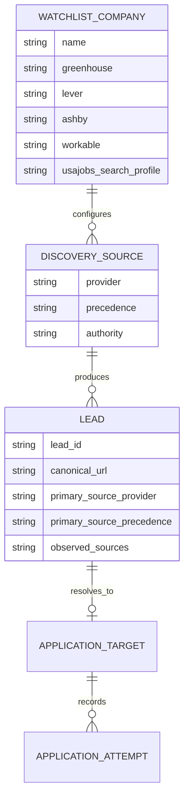

# Expand official job API integrations for discovery and future gated application integrations

## Overview

Broaden `job-hunt` beyond the current `greenhouse`, `lever`, `indeed_search`, and generic `careers` discovery set by adding more official/public job feeds where they exist, while keeping application submission automation inside the repo's existing trust and policy boundaries.

The practical conclusion from research is:

- public, self-serve discovery APIs are available and worth using
- public, self-serve seeker-side application-submission APIs are effectively not available on mainstream job boards
- application submission APIs that do exist are mostly ATS/customer/partner integrations and must be treated as a separate, later capability

This plan therefore splits the work into two lanes:

1. **Discovery expansion now** via official/public feeds
2. **Submission integration later** via a separate follow-up plan for explicit ATS/customer-approved integrations only

This follows the repo's earlier decision to start with search/score first and add application automation in a controlled way (see brainstorm: `docs/brainstorms/2026-04-15-job-hunt-brainstorm.md`).

## Problem Statement

The repo already has a solid multi-board application architecture and a provider seam for discovery, but there is still a mismatch between what is technically possible and what is currently implemented:

- `src/job_hunt/discovery_providers/registry.py` has room for more first-class sources, but only Greenhouse, Lever, Indeed search, and generic careers are registered today.
- `src/job_hunt/ingestion.py` already knows how to fetch Ashby posting detail URLs, but discovery does not yet surface Ashby boards as a first-class source.
- Broad job discovery still depends too heavily on scraped or manually supplied entry points when several official feeds exist.
- The current discovery baseline already has compatibility drift to clean up first: runtime source tokens and source-catalog claims have moved ahead of the persisted-schema/source-contract in a few places, so adding more providers without a baseline parity pass would compound the problem.
- Submission automation currently assumes browser-driven playbooks, but research confirms that mainstream job boards do not expose open seeker-side “fill and submit applications by API” lanes we can safely rely on.

Without an explicit plan, the likely failure mode is architectural drift:

- bolting on new boards ad hoc
- widening prohibited-origin automation accidentally
- mixing public discovery sources with partner-only submission paths
- promising dedupe and provenance behavior that the current identity model cannot actually support

## Research Summary

### Strong discovery sources we can use now

These official/public/self-serve feeds are implementation-ready:

- Greenhouse Job Board API
- Lever Postings API
- Ashby public job postings API
- Workable public account jobs endpoint
- USAJOBS Search API

Provider-specific notes from the current official docs:

- **Ashby** exposes a public job-board feed at `GET /posting-api/job-board/{JOB_BOARD_NAME}` with fields including `jobUrl`, `applyUrl`, `publishedAt`, `employmentType`, `workplaceType`, `isRemote`, and `isListed`. `isListed=false` is explicitly documented as direct-link-only and should not be surfaced by default discovery.
- **Workable** exposes public jobs at `GET /api/accounts/{subdomain}` and supports a `details=true` query param to include descriptions. This makes it a good fit for a first-class public provider with an optional low-detail polling mode.
- **USAJOBS** exposes search at `GET /api/Search`, but unlike Ashby/Workable it requires request headers including `Host`, `User-Agent`, and `Authorization-Key`. The docs describe a default page size of 250, a max of 500 rows per page, and a max of 10,000 rows per query. That makes it an official discovery source, but not a no-config source.

These are useful but lower-priority supplemental sources:

- Adzuna API
- Remotive public API / RSS

### Submission APIs that exist but are not open seeker APIs

These platforms support API-based application creation in some form, but only for ATS customers, official partners, or employer-authorized integrations:

- Greenhouse Job Board API `POST`
- Lever Postings API `POST`
- SmartRecruiters Application API
- Workable candidate create endpoints
- Indeed Apply / Apply with Indeed

More specifically, the current docs reinforce that these are not generic seeker APIs:

- **Greenhouse** application submission uses `POST /v1/boards/{board_token}/jobs/{id}` with HTTP Basic Auth using an API key over TLS, which is a customer-controlled integration surface rather than a public seeker capability.
- **Lever** documents `POST /v0/postings/{SITE}/{POSTING-ID}?key=APIKEY` for custom forms and explicitly warns that application-create requests are rate limited, again pointing to customer-owned hosted or embedded integrations rather than a repo-wide public apply surface.

LinkedIn’s `Apply with LinkedIn` remains strategically unattractive because LinkedIn states it is not accepting new AWLI partners as of the current documentation set.

### Key product conclusion

For this repo, the best expansion path right now is:

- use official/public APIs for discovery wherever possible
- keep browser automation for application execution on public/seeker flows
- leave authenticated write-lane design to a separate future plan once there is a real approved customer/partner use case

This preserves the repo's trust-first posture and avoids designing around a seeker-side API capability that does not actually exist.

## Section Manifest

This plan needs depth in five areas:

1. **Public provider contracts**: exact request/response assumptions for Ashby, Workable, and USAJOBS
2. **Compatibility-safe rollout**: consumer-first schema and artifact sequencing before provider emission
3. **Source provenance model**: exact-URL precedence, observed-source retention, and auditability
4. **Future integration boundary**: keep policy and artifact prerequisites explicit without designing a dormant write framework here
5. **Verification and operations**: tests, fixtures, config examples, structured errors, and runbook/documentation coverage

## Proposed Solution

### Scope

Ship a phased integration program that:

- adds new **public discovery providers** for Ashby, Workable, and USAJOBS first
- adds one **supplemental aggregator provider** abstraction for optional feeds like Adzuna later
- keeps credential-gated application APIs **out of implementation scope for this plan**
- keeps the human-submit invariant and prohibited-origin boundaries intact

### Target capability model

Split the world explicitly into three categories:

1. **Public discovery provider**
   Example: Greenhouse, Lever, Ashby, Workable, USAJOBS
2. **Supplemental aggregator provider**
   Example: Adzuna, Remotive
3. **Credential-gated application integration**
   Example: Greenhouse customer key, Lever customer key, SmartRecruiters customer token, Workable partner/customer token, Indeed partner flow

The repo should never treat category 3 as if it were category 1.

### Non-Goals In This Plan

This plan does **not**:

- add a credential-gated application integration registry
- add new `prepare-application` execution lanes or status enums
- change application CLI JSON contracts
- add new persisted application artifact fields for integrations

Those changes require a separate follow-up plan after two prerequisites are true:

1. current `plan.json` / `status.json` schema parity is fixed for already-emitted fields and surfaces
2. there is a real approved customer/partner credential use case worth designing around

## Technical Approach

### Architecture

The cleanest fit is to extend the existing provider model rather than introducing a second discovery framework.

Design invariants carried forward from prior repo learnings:

- keep **origin/source** separate from **execution surface**
- keep `src/job_hunt/discovery_providers/registry.py` as the single discovery-provider authority
- keep `src/job_hunt/boards/registry.py` plus `ApplicationTarget` as the routing authority for application execution
- keep `src/job_hunt/surfaces/registry.py` as metadata/policy lookup after the routing decision is made
- land tolerant readers / optional fields before producers emit richer source metadata
- keep credentials and tokens as runtime-only inputs, never tracked artifacts
- preserve the compile-time invariant that the human clicks final Submit
- any future gated integration plan must keep `ApplicationTarget` as the single resolved runtime record instead of introducing a parallel integration-resolution object
- any future gated integration plan must never reopen fetch or automation on a prohibited-origin host

### Decision Ledger

To keep the plan internally consistent, every major decision here affects multiple sections/artifacts:

1. **Public discovery and future gated integrations are separate capabilities**
   Affects architecture, rollout sequence, schemas, docs, acceptance criteria, and tests
2. **Discovery provenance rollout is additive-first**
   Affects `schemas/lead.schema.json`, discovery run artifacts, and backward-compatibility tests
3. **Winner selection and observed-source retention are separate concerns**
   Affects lead artifacts, auditability, dedupe logic, and reports
4. **Any future integration work needs application schema-parity cleanup first**
   Affects existing application artifact schemas, compatibility tests, and follow-up planning
5. **Aggregators land only after authority metadata**
   Affects phase ordering, source precedence logic, and duplicate-handling tests
6. **USAJOBS readiness and pagination need named runtime owners**
   Affects discovery cursor state, CLI JSON contracts, structured errors, and provider rollout order
7. **Current discovery contract drift gets fixed before expansion**
   Affects `SOURCE_NAME_MAP`, `schemas/lead.schema.json`, `config/sources.yaml`, CLI help text, and compatibility tests

#### Discovery

Keep `src/job_hunt/discovery_providers/registry.py` as the top-level authority for source registration. Add new providers in the same style as the current Greenhouse/Lever/Indeed entries.

Recommended provider additions:

- `src/job_hunt/discovery_providers/ashby.py`
- `src/job_hunt/discovery_providers/workable.py`
- `src/job_hunt/discovery_providers/usajobs.py`
- later: `src/job_hunt/discovery_providers/adzuna.py`

Optional later refactor after the provider rollout is stable:

- migrate provider-specific HTTP/extraction helpers into a shared package such as `src/job_hunt/discovery_sources/`
- only do this if the repo also migrates existing providers toward the same shape
- do not introduce a second architecture that applies only to the new providers in the first slice

Recommended provider responsibilities:

- provider modules own watchlist entry interpretation and provider-specific fetch/extract logic in the initial slice
- a later shared-helper refactor can centralize HTTP request construction, pagination, normalization, and provider-specific error mapping once at least one existing provider is migrated too
- `src/job_hunt/discovery.py` remains the orchestration entrypoint and should not become a second registry or provider-routing authority

Provider-specific contracts:

- **Ashby**
  - Watchlist input should be a board slug, not a full URL
  - Fetch `GET https://api.ashbyhq.com/posting-api/job-board/{slug}`
  - Default `includeCompensation=false` for lighter polling; expose compensation later only if the lead schema has a clear home for it
  - Drop entries where `isListed` is false unless a future explicit config says otherwise
  - Use `jobUrl` as canonical lead URL and retain `applyUrl` as non-authoritative auxiliary metadata if needed
- **Workable**
  - Watchlist input should be the Workable subdomain/account identifier
  - Fetch `GET https://www.workable.com/api/accounts/{subdomain}`
  - Start with `details=false` for broad polling and allow targeted detail fetch only when downstream content requires it
  - Normalize account-level response objects to existing `ListingEntry` fields without inventing Workable-only required schema
- **USAJOBS**
  - Watchlist input should be a named search profile, not a raw opaque URL, because the API is parameterized and credentialed
  - Require secrets from env vars or local untracked files such as `.env.local`, never tracked config
  - Fail closed with structured config/auth errors owned by the discovery layer
  - Use an explicit readiness/error contract: readiness states `profile_missing`, `credentials_missing`, `ready`; structured error codes `usajobs_profile_missing`, `usajobs_credentials_missing`, and `usajobs_auth_invalid`
  - Persist only non-secret search/profile metadata in run artifacts; never persist raw auth headers or keys

Compatibility rules:

- do not require new `ListingEntry` fields for Phase 1
- expand `discovered_via.source` schema support and compatibility tests before any new provider emits a new source value
- any new lead metadata fields must be optional first
- current downstream lead consumers must keep working with providers that do not populate the richer metadata yet

This mirrors the repo’s existing direction toward registry-owned routing and avoids turning `job_hunt.discovery` into another overloaded module surface (see `docs/solutions/workflow-issues/land-multi-board-architecture-with-registry-owned-routing.md`).

#### Ingestion

Move platform-specific fetchers out of the growing monolith in `src/job_hunt/ingestion.py` over time, but do not make that a prerequisite for Phase 1. The immediate plan should reuse existing canonicalization, fetch safety, prompt-injection wrapping, and structured errors.

Immediate rule:

- new public discovery providers may call existing safe fetch plumbing
- new provider-specific detail fetchers should reuse `fetch()` and `canonicalize_url()`
- do not bypass `is_hard_fail_url()` or domain allowlist semantics

Additional implementation notes:

- reuse `net_policy.DomainRateLimiter` rather than creating provider-local throttling logic
- keep robots behavior explicit per source type: ATS/public feeds with documented API endpoints should go through the repo's existing allow/deny model rather than quietly bypassing it
- map provider failures to existing structured error envelopes where possible; only add a new discovery error code if there is real branching value for agents or operators
- do not make an ingestion refactor a prerequisite for adding Ashby/Workable/USAJOBS; defer monolith breakup until after provider behavior is stable

#### Future gated integrations

This plan intentionally stops at discovery expansion plus policy clarification.

For a future dedicated integration plan, carry forward these requirements:

- browser-playbook surfaces and authenticated write integrations remain distinct abstractions
- any integration authorization must be based on execution surface / execution host, not `origin_board`
- raw credentials, tokens, auth headers, and secret-bearing request payloads remain runtime-only or redacted before persistence
- application CLI JSON contracts, status schemas, and tolerant-reader tests must land before any integration-aware producer behavior
- existing `plan.json` / `status.json` schema parity for already-emitted fields and surfaces must be fixed first

### Implementation Phases

### Rollout Sequence

To avoid the split-brain and compatibility problems seen in earlier deepening work, land this in a consumer-first sequence:

1. restore the existing discovery baseline to parity first: align `SOURCE_NAME_MAP`, `schemas/lead.schema.json`, CLI/source help text, and `config/sources.yaml` so every already-supported emitted source token is schema-valid and operator-visible claims match runtime support
2. expand `schemas/lead.schema.json` and compatibility tests for any new `discovered_via.source` values
3. land additive discovery provenance readers and fixtures before new providers emit richer metadata
4. add Ashby first, because the repo already recognizes Ashby URLs in ingestion/careers discovery
5. add Workable second, as a fuller but still public provider addition
6. extend discovery cursor/state handling to support provider-specific pagination and `next_cursor`, with compatibility for old cursor/state artifacts
7. add USAJOBS last, only after auth handling, readiness validation, cursor support, and explicit structured error remediation are ready
8. add exact-URL authority precedence before any aggregator rollout

If a later plan introduces new application enums, statuses, or CLI fields, update all consumers before producers emit them.

#### Phase 0: Discovery contract baseline and compatibility prep

Goal: repair existing discovery contract drift before adding new public providers.

Files:

- `schemas/lead.schema.json`
- `src/job_hunt/discovery.py`
- `src/job_hunt/core.py`
- `config/sources.yaml`
- `tests/test_integrity_and_compat.py`
- `tests/test_discovery_registry.py`

Tasks:

- Make every currently emitted `discovered_via.source` token schema-valid before introducing any new ones
- Reconcile current runtime-supported source tokens and CLI/source help text with `config/sources.yaml`
- Add or tighten compatibility tests so `SOURCE_NAME_MAP` cannot drift ahead of the lead schema again
- Keep this phase strictly consumer/baseline focused; it should not add Ashby/Workable/USAJOBS emission yet

Success criteria:

- Every existing discovery source the runtime can emit is accepted by `schemas/lead.schema.json`
- Operator-facing source catalogs and CLI help text match actual runtime support
- The repo has a clean compatibility baseline before new providers land

#### Phase 1: Public discovery provider expansion

Goal: expand official/public discovery with minimal policy risk.

Files:

- `schemas/lead.schema.json`
- `schemas/discovery-cursor.schema.json`
- `src/job_hunt/discovery_providers/registry.py`
- `src/job_hunt/discovery_providers/base.py`
- `src/job_hunt/discovery.py`
- `src/job_hunt/watchlist.py`
- `src/job_hunt/core.py`
- `schemas/watchlist.schema.json`
- `config/watchlist.example.yaml`
- `config/sources.yaml`
- `tests/test_discovery_registry.py`
- `tests/test_integrity_and_compat.py`
- `tests/test_watchlist.py`
- new provider tests such as `tests/test_discovery_ashby.py`

Tasks:

- Expand `discovered_via.source` schema support before any new provider emits a new source token
- Extend discovery cursor/state handling so provider-specific pagination state can be persisted and resumed safely
- Add first-class Ashby discovery provider using the public Ashby job postings feed
- Add first-class Workable discovery provider using the public account jobs feed
- Add first-class USAJOBS discovery provider with API-key-based auth
- Extend watchlist/config schema to support these sources cleanly
- Normalize provider outputs to the existing `ListingEntry` contract
- Preserve dedupe, canonicalization, rate limiting, and scoring semantics

Concrete rollout notes:

- extend the flat `WatchlistEntry` shape with optional fields such as `ashby`, `workable`, and a non-secret USAJOBS query/profile field
- avoid a nested `sources:` watchlist refactor in this slice; additive flat fields are the compatibility-safe path
- keep validation narrow: slug/account identifiers for Ashby/Workable, structured parameter validation for USAJOBS
- include the full watchlist round-trip surface in this rollout: model, validation, `has_source()`, serializer, CRUD helpers, CLI help/parser, and tests
- treat Phase 0 parity as a hard prerequisite; Phase 1 may extend source enums but must not also be responsible for fixing already-existing drift
- add compatibility coverage that `SOURCE_NAME_MAP` and emitted `discovered_via.source` values remain schema-valid
- register new providers in `discovery_providers/registry.py` only after tests cover “missing source config returns empty page”
- update source-token validation and CLI/source help text in `src/job_hunt/discovery.py` and `src/job_hunt/core.py` in the same change as registry expansion
- update `config/sources.yaml` in lockstep with actual runtime support so the operator-facing source catalog stays honest
- add provider fixtures that cover pagination/truncation and “missing optional field” responses
- load USAJOBS secrets from env or local ignored files and document the required headers with remediation text
- name the agent-usable USAJOBS readiness owner explicitly: extend `discover-jobs` preflight / validation output in `src/job_hunt/core.py` with structured JSON states `profile_missing`, `credentials_missing`, and `ready`
- define exact structured error ownership and codes for USAJOBS config/auth failures before implementation; the discovery layer owns `usajobs_profile_missing`, `usajobs_credentials_missing`, and `usajobs_auth_invalid`
- update `DISCOVERY_ERROR_CODES`, static enum coverage tests, and CLI remediation assertions in the same change as any new USAJOBS failure mode
- update `schemas/discovery-cursor.schema.json` and either ship a schema-version bump plus migration or document delete-and-rescan recovery for old cursor/state files
- keep USAJOBS behind the pagination/cursor prerequisite; do not ship it as a single-page provider
- if the generic careers crawler already detects ATS hits for a new provider, extend promotion/expansion logic in the same change so detection does not silently stop short of ingestion

Suggested provider test cases:

- Ashby listed vs unlisted posting (`isListed=true/false`)
- Ashby remote/hybrid/on-site normalization
- Workable with `details=false` list response and optional detail fetch
- USAJOBS missing key, invalid key, and successful paged search
- USAJOBS old cursor/state artifacts recover cleanly after the pagination upgrade
- existing providers still produce identical normalized entries after the registry expansion
- Phase 0 parity coverage proves every existing emitted source token remains schema-valid before new provider emission begins
- mixed-source discovery orchestration updates `discovered_via.source` compatibly with the lead schema
- USAJOBS readiness validation distinguishes profile/config/auth failures in JSON-visible ways

Success criteria:

- `discover-jobs` can ingest these new sources without changing downstream lead consumers
- lead records remain source-normalized and scoreable
- no policy boundary is widened for LinkedIn, Indeed submission, or other prohibited-origin flows
- missing USAJOBS credentials fail with explicit structured remediation instead of generic network error
- Ashby does not surface `isListed=false` jobs by default

#### Phase 2: Source metadata and routing hardening

Goal: make discovery-source growth durable and analyzable.

Files:

- `src/job_hunt/discovery.py`
- `src/job_hunt/ingestion.py`
- `schemas/lead.schema.json`
- `schemas/discovery-run.schema.json`
- `src/job_hunt/core.py`
- `tests/test_discovery.py`
- `tests/test_tracking.py`
- `docs/guides/job-discovery.md`

Tasks:

- Add minimal explicit source metadata on leads for auditability and precedence
- Preserve all observed sources separately from the chosen primary source
- Capture provider-specific pagination and refresh metadata only where it changes behavior materially
- Document exact-URL precedence rules for dedupe when the same canonical posting URL appears in multiple feeds

Recommended source semantics for the first safe slice:

- `lead.source`: stable compatibility alias for `primary_source.provider` until a later explicit deprecation plan lands
- `primary_source.provider`: concrete provider id such as `ashby` or `usajobs`
- `primary_source.authority`: `system_of_record` | `derived`
- `primary_source.precedence`: `ats_public` | `government_api` | `board_search` | `aggregator`
- `observed_sources[]`: append-only list of all observed providers / precedence classes that collapsed into the same canonical URL

Canonical precedence contract:

- `primary_source.precedence` is the only persisted precedence field; downstream consumers must not reconstruct precedence from `provider` + `authority`
- one shared comparator helper such as `compare_source_precedence(left, right)` should own winner selection for dedupe, analytics, and reports
- `ats_public`
- `government_api`
- `board_search`
- `aggregator`

Initial dedupe rule:

- precedence only arbitrates when multiple observations collapse onto the same canonical posting URL
- if two providers expose different URLs for what appears to be the same job, they remain separate leads in this plan
- a later follow-up plan may add cross-source identity/fingerprint matching before broader authority-based collapse is promised

Strict-promotion rule after additive rollout:

- legacy leads may omit `primary_source` / `observed_sources[]`
- newly written leads from in-scope providers must populate both fields once Phase 2 is complete
- add a `check-integrity` rule that flags newly emitted in-scope leads missing required provenance fields while continuing to tolerate older artifacts

Routing boundary rule:

- application routing may use canonical URL, application URL, and provider-derived execution hints
- application routing must not branch on `primary_source.authority`, `primary_source.precedence`, or `observed_sources[]`

Success criteria:

- the repo can tell “this came from the ATS itself” apart from “this came from an aggregator”
- exact-URL dedupe and scoring stay stable when duplicate listings appear from multiple channels
- lead artifacts preserve both `primary_source` and `observed_sources[]` for auditability
- `lead.source` remains stable for agent-facing source filtering during the rollout
- old leads without the new optional metadata remain valid and readable

#### Phase 3: Optional supplemental aggregators

Goal: add breadth without confusing source authority.

Files:

- `src/job_hunt/discovery_providers/adzuna.py`
- `src/job_hunt/discovery_providers/remotive.py`
- `tests/test_discovery_aggregators.py`
- `docs/guides/job-discovery.md`

Tasks:

- Add Adzuna as an optional provider
- Optionally add Remotive as a remote-only discovery source
- Mark these feeds as lower-authority than direct ATS/public company feeds
- Prevent exact-URL aggregator duplicates from outranking direct ATS leads automatically
- Do not start this phase until Phase 2 source-authority metadata is already landed

Success criteria:

- supplemental feeds improve volume without degrading trust in lead origin

## Alternative Approaches Considered

### 1. Keep the current discovery set and rely on generic careers crawl

Rejected because:

- it leaves official/public APIs unused
- it creates unnecessary scrape variability
- it underuses the repo’s growing provider abstraction

### 2. Build broad seeker-side auto-apply around “job board apply APIs”

Rejected because:

- research did not find a credible open/public seeker-side apply API lane for mainstream platforms
- it would push the repo toward policy-unsafe assumptions
- it conflicts with the repo’s human-submit and trust-first posture

### 3. Treat partner/customer integrations as just another discovery provider

Rejected because:

- it collapses public discovery and authenticated write access into one abstraction
- it obscures policy and credential boundaries
- it would make audits and support much harder

## System-Wide Impact

### Interaction Graph

`watchlist` entry or CLI source selection triggers provider resolution in `src/job_hunt/discovery_providers/registry.py`, which calls provider-specific listing fetchers, which reuse `src/job_hunt/discovery.py` orchestration and `src/job_hunt/ingestion.py` fetch/canonicalization rules, which produce normalized leads under `data/leads/`, which then flow unchanged into scoring, draft generation, and application planning.

Routing note:

- `origin_board` / discovery provenance answers "where did this lead come from?"
- `surface` answers "what host/playbook executes the apply flow?"

Those are related but distinct facts and should not be collapsed into one field.

Concrete consumer boundary:

- discovery provenance (`lead.source`, `primary_source`, `observed_sources[]`) is for auditability, filtering, and analytics
- application routing stays in `boards/registry.py` via `ApplicationTarget` resolution and may consume execution facts such as canonical/apply URLs or provider-derived execution hints
- application routing must not consume provenance authority/precedence metadata

### Error & Failure Propagation

New discovery providers must continue using structured errors at the I/O boundary:

- public provider request failures map to discovery/ingestion structured errors
- provider auth failures for API-key sources like USAJOBS need explicit remediation text

Recommended additional error handling:

- distinguish provider-not-configured from provider-request-failed so batch discovery can skip unavailable configured sources cleanly
- keep provider-specific auth/config failures machine-actionable only when there is a clear agent branch to take
- assign USAJOBS config/auth validation to the discovery layer and add explicit structured error codes there before implementation: `usajobs_profile_missing`, `usajobs_credentials_missing`, `usajobs_auth_invalid`
- preserve the CLI JSON stdout contract for all new commands and failure modes
- verify failure-path artifacts redact `Authorization-Key`, `User-Agent` email, and raw headers from `data/runs/` or any structured error payloads

Do not let USAJOBS config/auth failures degrade into generic network failure.

### State Lifecycle Risks

Main risks:

- duplicate lead creation from overlapping feeds
- stale provider cursors or pagination state
- inconsistent source precedence when the same canonical URL appears via ATS and aggregator
- producers emitting new source metadata before readers/schemas accept them

Mitigations:

- canonical URL dedupe remains authoritative
- source authority fields are added before aggregator rollout
- observed-source retention preserves losing-side provenance for audits
- optional-field / tolerant-reader rollout precedes any stricter producer behavior
- `check-integrity` hardens the new provenance invariant for newly emitted in-scope leads after rollout

### API Surface Parity

Equivalent discovery surfaces should share the same downstream contract:

- `greenhouse`
- `lever`
- `ashby`
- `workable`
- `usajobs`
- optional `adzuna`

### Integration Test Scenarios

- A job appears in both Workable and Adzuna with the same canonical URL; the repo keeps one canonical lead, records both observations, and prefers the higher-precedence source.
- USAJOBS API key is missing or invalid; discovery returns a structured error and does not poison the whole run.
- Ashby public feed returns an unlisted job; the provider does not surface it publicly if the feed semantics or config say it should remain hidden.
- An old lead lacking `primary_source` / `observed_sources[]` still validates and remains scoreable after Phase 2 ships.
- Two providers expose different URLs for the same human-visible job title; the repo keeps separate leads until a future cross-source identity plan exists.

## Spec Gaps Closed During Planning

The main specification gaps identified during planning are:

- “job API” means two different things in practice: public discovery feed vs authenticated write integration
- source provenance and execution surface must remain separate, per the repo’s existing origin/surface separation guidance
- adding aggregators without source-authority metadata would degrade trust in the lead corpus
- cross-source authority arbitration requires an identity bridge; exact-URL collapse is the only promised behavior in this plan
- USAJOBS must be modeled as an official API source that still needs local credentials and explicit auth remediation
- provider-specific feed semantics such as Ashby `isListed` affect what "public discovery" actually means
- any future integration plan must start from a cleaned-up application schema baseline

## Data Model Sketch

## Acceptance Criteria

### Functional Requirements

- [ ] `discover-jobs` supports Ashby public board discovery via `src/job_hunt/discovery_providers/ashby.py`
- [ ] `discover-jobs` supports Workable public board discovery via `src/job_hunt/discovery_providers/workable.py`
- [ ] `discover-jobs` supports USAJOBS discovery via `src/job_hunt/discovery_providers/usajobs.py`
- [ ] Watchlist/config schemas can represent these new discovery sources without breaking existing entries
- [ ] Lead artifacts preserve source provenance and can distinguish direct ATS/public feeds from aggregators
- [ ] No new public command or docs language implies seeker-side API auto-submit is broadly available
- [ ] Ashby discovery excludes `isListed=false` jobs unless an explicit future policy says otherwise
- [ ] USAJOBS discovery documents and validates required local auth config before runtime
- [ ] Phase 0 restores parity for every already-emitted discovery source token before any new provider emits new ones
- [ ] Provider emission of new `discovered_via.source` values happens only after schema and compatibility coverage lands
- [ ] `lead.source` remains a compatibility alias for agent-facing source selection during the rollout

### Non-Functional Requirements

- [ ] Existing discovery safety invariants in `src/job_hunt/ingestion.py` remain intact
- [ ] New providers reuse structured error envelopes and existing stdout JSON CLI contract
- [ ] No secrets, tokens, or session material are written to git-tracked files
- [ ] Human-submit and account-creation approval boundaries remain unchanged unless a later plan explicitly tightens them
- [ ] Old lead/application artifacts remain readable during the rollout because new fields are additive first
- [ ] The plan does not promise cross-source authority collapse beyond exact-URL duplicates
- [ ] USAJOBS secret inputs come only from env vars or local ignored files, not tracked config

### Quality Gates

- [ ] Provider-specific tests exist for each new public source
- [ ] Dedupe and authority precedence tests cover overlapping exact-URL cases
- [ ] Docs explain discovery-source categories and integration boundaries clearly
- [ ] Fixtures cover USAJOBS auth failure remediation and Ashby unlisted-posting suppression
- [ ] Consumer-first schema tests cover any new source-metadata fields before producers emit them
- [ ] One shared precedence helper/contract is named and reused instead of letting consumers infer precedence ad hoc
- [ ] Provenance tests cover both `primary_source` winner selection and `observed_sources[]` retention
- [ ] Cursor/state compatibility tests cover old discovery cursor artifacts after pagination support lands
- [ ] Integrity checks enforce provenance population for newly written in-scope leads after rollout

## Success Metrics

- discovery breadth increases by at least three new official/public sources without lowering lead-quality confidence
- the repo can classify every shipped discovery source by precedence and authority
- no tracked artifact contains credential material during test or trial runs
- future ATS/customer integration planning starts from a cleaner, narrower discovery baseline

## Dependencies & Prerequisites

- Existing provider registry and discovery orchestration remain the extension seam
- A small schema extension for watchlist/source metadata is acceptable
- USAJOBS usage requires an API key request and local configuration
- Any future customer/partner write integration requires explicit legal/policy review plus credential provisioning
- `.gitignore` and local-config conventions must already exclude any new integration-local config artifacts

## Risk Analysis & Mitigation

- **Risk:** public API terms change or rate limits tighten
  Mitigation: keep provider boundaries narrow and error remediation explicit
- **Risk:** aggregators dilute source trust
  Mitigation: add source-authority metadata before shipping aggregator support
- **Risk:** a future PR reopens prohibited-origin automation under the guise of integrations
  Mitigation: keep gated integrations out of this plan and carry forward the hard invariant into the follow-up plan
- **Risk:** provider-specific semantics are normalized away incorrectly
  Mitigation: add provider contract tests for Ashby `isListed`, Workable detail mode, and USAJOBS auth/pagination
- **Risk:** new metadata lands in prose but not schemas/tests/artifacts
  Mitigation: treat plan editing as a consistency pass and update acceptance criteria, file lists, tests, and docs in the same revision
- **Risk:** precedence rules are applied to records that the runtime cannot yet prove are the same job
  Mitigation: limit precedence claims to exact-URL duplicates until a future identity/fingerprint plan exists

## Resource Requirements

- Moderate engineering effort for public discovery providers
- Low-to-moderate schema and docs work
- Separate future policy/research effort for any partner/customer write integration

## Future Considerations

- Add SmartRecruiters public/feed discovery if access model and token story justify it
- Add richer board capability analytics so the repo can answer “which boards are best for my profile?” from observed outcomes
- Support mutual-customer ATS integrations only after the public/source model is stable and application schema parity is fixed
- Consider a dedicated `source catalog` report under `docs/reports/source-capabilities.md`

## Documentation Plan

- Update `docs/guides/job-discovery.md` with new source categories and examples
- Update `README.md` to describe public discovery vs future gated application integrations
- Add a short architectural note documenting why public discovery providers and authenticated write integrations are separate plans
- Document provider-specific setup examples for Ashby slug, Workable subdomain, and USAJOBS local auth configuration
- Document exact-URL source precedence and observed-source retention so operators understand why a direct ATS lead can outrank an aggregator copy without erasing provenance

## Sources & References

### Origin

- **Brainstorm document:** `docs/brainstorms/2026-04-15-job-hunt-brainstorm.md`
  Key decisions carried forward:
  - start with search/score-first, apply-second rollout
  - keep provenance and auditability first-class
  - avoid overcommitting to full autonomy before trust boundaries are explicit

### Supporting Internal References

- `docs/brainstorms/2026-04-16-indeed-auto-apply-brainstorm.md`
- `src/job_hunt/discovery_providers/registry.py`
- `src/job_hunt/discovery.py`
- `src/job_hunt/ingestion.py`
- `src/job_hunt/surfaces/registry.py`
- `playbooks/application/generic-application.md`
- `docs/solutions/workflow-issues/harden-board-integration-plans-with-origin-surface-separation.md`
- `docs/solutions/workflow-issues/land-multi-board-architecture-with-registry-owned-routing.md`
- `docs/solutions/workflow-issues/ship-tolerant-consumers-before-strict-producers.md`
- `docs/solutions/security-issues/human-in-the-loop-on-submit-as-tos-defense.md`

### External References

- Greenhouse Job Board API: https://developers.greenhouse.io/job-board.html
- Lever Postings API: https://github.com/lever/postings-api
- Ashby public job postings API: https://developers.ashbyhq.com/docs/public-job-posting-api
- Workable public jobs endpoint: https://workable.readme.io/reference/jobs-1
- USAJOBS authentication guide: https://developer.usajobs.gov/guides/authentication
- USAJOBS rate limiting guide: https://developer.usajobs.gov/guides/rate-limiting
- Workable partner token docs: https://workable.readme.io/reference/partner-token
- SmartRecruiters Application API: https://developers.smartrecruiters.com/docs/application-api
- Indeed Apply: https://docs.indeed.com/indeed-apply
- Indeed ATS guidelines: https://docs.indeed.com/ats-guidelines/
- LinkedIn AWLI development docs: https://learn.microsoft.com/en-us/linkedin/talent/apply-with-linkedin/apply-with-linkedin?view=li-lts-2026-03
- LinkedIn help on Apply with LinkedIn: https://www.linkedin.com/help/linkedin/answer/a414454/enable-apply-with-linkedin
- USAJOBS API reference: https://developer.usajobs.gov/api-reference/
- Adzuna API: https://developer.adzuna.com/
- Remotive public jobs API: https://remotive.com/remote-jobs/api

### Related Work

- `docs/plans/2026-04-16-004-feat-active-job-discovery-plan.md`
- `docs/plans/2026-04-16-005-feat-indeed-auto-apply-plan.md`
- `docs/plans/2026-04-19-001-feat-linkedin-and-board-adapters-plan.md`
- `docs/plans/2026-04-19-004-feat-multi-board-application-architecture-plan.md`
- `docs/plans/2026-04-20-001-feat-glassdoor-board-support-plan.md`
