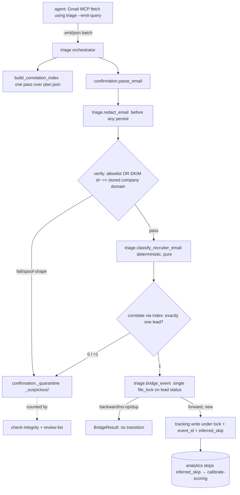

# Inbound email → lead-status triage

## Enhancement Summary

**Deepened:** 2026-05-18 · **Reviewers:** data-integrity-guardian,
security-sentinel, architecture-strategist, kieran-python-reviewer,
code-simplicity-reviewer, agent-native-reviewer, performance-oracle.

### Key improvements folded in (and *why the original was wrong*)

1. **Correlation is now deterministic exact-match, not a confidence score.**
   Security proved the fuzzy path is forgeable end-to-end by an
   unauthenticated remote attacker; simplicity independently flagged the
   score as dead complexity for a single-user tool. Replaced with **DKIM
   `d=` registrable-domain (PSL) equality against the *stored* lead
   company domain**, DMARC-aligned, display-name/body ignored.
2. **Analytics is in-scope, not "untouched."** The original "Alternatives
   Considered" claim was incorrect: `inferred_skip` exclusion and the
   analytics-vs-tracking `ghosted` terminal mismatch *must* be fixed here
   or `calibrate-scoring` is fed phantom funnel progress — defeating the
   feature's entire purpose.
3. **No `poll_confirmations` edit (import-cycle fix).** Triage is driven by
   its own orchestrator that *calls* `confirmation`; `confirmation` never
   names `triage`. Phase 1 no longer touches the shipped confirmation path.
4. **Error model corrected:** `TriageError(StructuredError)` (CLI does
   `**exc.to_dict()`); the original "keep bare `ValueError`" was
   self-contradictory at a CLI-wrapped boundary.
5. **Single-lock pre-validate-and-write** on Model B (TOCTOU fix);
   create-if-missing under the same lock; append-vs-noop must be derived
   from Model-A `events[]`, not `update_status`'s return value.
6. **Invariant 5 downgraded "prevented" → "detected + replayable"** with a
   named repair path (idempotency makes replay safe).
7. **Per-run correlation index** (mirrors `analytics._load_*_by_id`);
   redaction input-bounded (DoS guard); lock-ordering specified.
8. **Scope cut ~40%:** confidence engine → a rule; quarantine review reuses
   the existing `review-*` triad instead of a new one; ghost-timeout
   deferred to Phase 3; tolerant-rollout *ceremony* language dropped
   (phases kept only for shippability, not as a consumer/producer split).

### New considerations discovered

- A spoofed-outcome email is a **targeted integrity attack on the learning
  loop**, not a precision nit — outcomes from non-allowlisted senders are
  quarantine-only, never silent.
- `confirmation.update_status` returns the same dict whether it appended or
  deduped — the bridge must inspect Model-A `events[]` directly.
- `tracking` permits transitions *out of* `ghosted` (semi-terminal) while
  `analytics` treats `ghosted` as terminal → lost/double-counted outcomes.
- Three stage ladders will exist (`triage.STAGE_LADDER`,
  `analytics.STAGE_SEQUENCE`, `confirmation._PRIORITY`) — one must be the
  cited source of truth with a consistency test.

---

## Overview

`calibrate-scoring` (the just-shipped Phase-4 learning loop) is
**data-starved**: it only learns from outcomes in the tracking ledger, and
outcomes only enter via a human running `update-status` by hand. Nobody
logs every rejection, so the loop sits at `insufficient_data` forever.

This feature closes the loop **world → ledger → calibrate-scoring** by
extending the proven Gmail submit-confirmation pipeline
(`src/job_hunt/confirmation.py`) to classify *inbound recruiter/ATS email*
— rejection, phone-screen/interview invite, offer, assessment request —
and advance the matched lead's status. Ghost-timeout (absence of email) is
a separate, deferred time-based scan.

Trust posture mirrors `confirmation.py`: 3-gate verification (sender
allowlist → DKIM=pass → correlation), `_suspicious/` quarantine for
anything ambiguous/unverified, strict idempotency, **never fabricate a
status transition**.

## Problem Statement

The repo has **two disjoint status models** and the learning loop reads
only one:

| | Model A — confirmation | Model B — tracking/analytics |
|---|---|---|
| File | `data/applications/{draft_id}/status.json` | `data/applications/{lead_id}-status.json` |
| Key | `lifecycle_state`, `events[]` | `current_stage`, `transitions[]` |
| Writer | `confirmation.update_status` (`confirmation.py:329`) | `tracking.update_application_status` (`tracking.py:52`) |
| Idempotent | yes — `event_id=sha256("gmail:{message_id}:{event_type}")` | **no** |
| File lock | yes (`utils.file_lock`, `LOCK_EX\|LOCK_NB`) | **no** |
| Read by `calibrate-scoring` | **NO** | **YES** (`analytics.build_aggregator:146`) |

`confirmation.py` already does the hard part (Gmail handoff, allowlist,
DKIM, URL correlation, quarantine, event-id idempotency) but writes
**Model A only** and correlates only via `indeed_jk`/`posting_url`, which
recruiter/ATS emails do not carry. **The feature is a bridge**: reuse
Model-A verification, add a deterministic recruiter classifier + a
DKIM-bound correlation path, write into **Model B** (idempotent, locked,
no backward motion) so the loop is fed — and fix the analytics consumer so
the bridged data is not silently corrupted.

## Research Summary

Local research only (external skipped: the hard external surface is
already solved internally with solution docs; the new logic is
deterministic classification over already-verified email). Reused patterns
(conform, do not reinvent): 3-gate verify + `_suspicious/` quarantine
(`docs/ai/batches/batch-4-apply.md:62-78`); correlation-keys/ambiguous
(`docs/plans/2026-04-16-005-...:Phase 8`); redaction-as-boundary
(`docs/solutions/security-issues/design-secret-handling-as-a-runtime-boundary.md:49-74`);
event_id idempotency + priority ladder; policy-as-compile-time-invariant
(`docs/solutions/security-issues/human-in-the-loop-on-submit-as-tos-defense.md:129-153`).

Code anchors: `confirmation.py` (`ParsedEmail:98`, `EventType:95`,
`_classify_event:110`, `match_message:233`, `verify_sender:294`,
`update_status:329` [returns same dict on append *or* dedup-noop —
discriminator needed], `_quarantine:275`, `gmail_search_query:475`,
`_DKIM_PASS_RE` checks substring only, **ignores `d=`**); `tracking.py`
(`VALID_STAGES:10`, `update_application_status:52` — bare `ValueError`, no
lock, `TERMINAL_STAGES={accepted,rejected,withdrawn}:26`); `analytics.py`
(`CALLBACK_STAGES:41`, `TERMINAL_STAGES` adds `ghosted`:42,
`STAGE_SEQUENCE:45`, `_stage_conversions:233`, `_last_non_terminal_stage:440`,
`build_aggregator:125`); `utils.file_lock` is `LOCK_NB` → raises
`FileLockContentionError`, never deadlocks; core.py CLI templates
(`ingest-confirmation:3213` incl. `--dry-run`, `calibrate-scoring:2595`,
discovery `review-list/-promote/-dismiss:1934`).

## Proposed Solution

### Architecture

New module `src/job_hunt/triage.py` owns classification + the A→B bridge.
It **calls into** `confirmation.py` (verify/parse/quarantine) and
`tracking.py` (Model-B write). Dependency arrow is one-directional:
`triage → confirmation`, `triage → tracking`. **`confirmation` never
imports `triage`; `poll_confirmations` is not modified** (the original
post-`update_status` hook created a `confirmation ↔ triage` cycle). Triage
runs from its own CLI orchestrator.

Classification rules live **only in `triage`** (`classify_recruiter_email`);
`confirmation.EventType`/`_classify_event` stay frozen (extending the
`Literal` ripples into `_PRIORITY`/`_EVENT_TO_LIFECYCLE`).



### Trust invariants (compile-time, tested — not config)

1. No status write without verification: allowlisted sender **or** DKIM
   `d=` registrable-domain (PSL) **equal to the stored lead company
   domain**, DMARC-aligned with `From`. Display name and body are never
   trust inputs.
2. Ambiguous / zero / non-equal-domain → `_suspicious/` only; **zero**
   ledger writes.
3. No backward stage motion. Outcome events (`rejected/withdrawn/ghosted`)
   bypass the ladder **only from an allowlisted sender**; the same outcome
   from a non-allowlisted (DKIM-domain-matched) sender is
   **quarantine + human-promote only**, never silent (anti-spoof).
4. Idempotent across both models, keyed on the same `event_id`; the bridge
   decides append-vs-noop by scanning Model-A `events[]`, not by
   `update_status`'s (non-discriminating) return.
5. A↔B divergence is **detected and replayable** (not "prevented" — A is
   written before B is attempted, so a crash between them is possible):
   `check-integrity.unbridged_confirmations` lists Model-A events with no
   matching Model-B `event_id`; `triage --repair` re-applies them
   (idempotent ⇒ safe).
6. Recruiter `subject`+`body` redacted (`dataclasses.replace`) at one
   chokepoint **before** `_quarantine`, Model-A `events[].payload`, and any
   log line.
7. Runtime overrides may only tighten: threshold-free design; the trust
   predicate and ghost-day floor are module `Final` constants, asserted by
   a test that no flag/env loosens them. `triage.py` imports no LLM client
   (tested) — classification is pure regex over redacted text.

### API design (frozen — corrects the original ValueError contradiction)

```text
class TriageError(StructuredError):
    ALLOWED_ERROR_CODES = {triage_low_confidence, triage_ambiguous_correlation,
        triage_no_correlation, triage_status_locked, triage_unbridged,
        triage_sender_unverified}

@dataclass(frozen=True) RecruiterClass:
    label: Literal[rejection,phone_screen,interview,assessment_request,offer,unknown]
    matched_rule: str          # which regex fired — required for audit
@dataclass(frozen=True) CorrelationResult:
    lead_id: str | None        # set only on the single verified match
    candidates: tuple[str,...]
    decision: Literal[match,ambiguous,no_match,sender_unverified]
@dataclass(frozen=True) BridgeResult:
    outcome: Literal[advanced,noop_backward,noop_duplicate,noop_terminal,
                     skipped_contention,quarantined]
    lead_id: str | None; from_stage: str | None; to_stage: str | None
    event_id: str; inferred_skip: bool = False

classify_recruiter_email(parsed: ParsedEmail) -> RecruiterClass        # pure
correlate_recruiter(parsed, index, *, data_root=None) -> CorrelationResult
bridge_event(parsed, *, lead_id, data_root=None) -> BridgeResult       # NOT draft_id
redact_email(parsed: ParsedEmail) -> ParsedEmail                       # replace()
build_correlation_index(data_root) -> CorrelationIndex                 # one/run
scan_ghost_timeouts(*, data_root=None, days=GHOST_DAYS_DEFAULT) -> list[dict]
```

### Scope

In: deterministic classifier; DKIM-bound exact-match correlation + per-run
index; A→B bridge (single-lock pre-validate+write, create-under-lock,
ladder, cross-model idempotency, `BridgeResult`); redaction chokepoint;
**required analytics edits** (transition `event_id`/`inferred_skip` schema
+ `_stage_conversions`/`_last_non_terminal_stage`/`_weekly_counts` skip
`inferred_skip`; outcome derived from transition history so post-`ghosted`
reactivation is not lost/double-counted); `triage-inbox`
(`--dry-run`/`--emit-query`/`--window-days`); quarantine review via the
**existing** `review-list/-promote/-dismiss` (extended to the triage
quarantine source — no new triad); `check-integrity.unbridged_confirmations`
+ `triage --repair`. Phase 3: ghost-timeout scan.

Out: ML classification; unifying the two models; auto-tuning scoring
(calibrate-scoring stays propose-only — triage only feeds Model B);
replying to email; interview prep.

## Implementation Phases

Incremental delivery (each phase independently green; *not* a
producer/consumer rollout — single author, single branch).

### Phase 1 — Bridge + analytics-consumer correctness (foundation)

- `triage.bridge_event(parsed, *, lead_id, data_root) -> BridgeResult`:
  resolve `{lead_id}-status.json`; **acquire one `file_lock` on it**, then
  inside that lock: create-if-missing (`create_application_status`),
  read, pre-validate (ladder/terminal/no-op/dup-by-Model-A-`events[]`),
  write the transition with typed `event_id` + `inferred_skip`. No second
  lock acquisition anywhere in the path.
- Harden `tracking.update_application_status`: lock-free
  `_apply_transition_locked` core that the bridge calls while holding the
  lock; the public function keeps its bare-`ValueError` contract for the
  manual CLI but both paths use identical `check_mtime`.
- **Schema now (load-bearing):** add typed `event_id: str`,
  `inferred_skip: bool` to the transition object in
  `schemas/application-status.schema.json` (back-compat optional).
- **Analytics fix (in-scope, was wrongly deferred):**
  `_stage_conversions`, `_last_non_terminal_stage`, `_weekly_counts` skip
  `inferred_skip` transitions; outcome classification derives from
  transition *history* (ever-reached terminal) not `current_stage`, so
  `ghosted → onsite` reactivation is neither lost nor double-counted.
  Document + test the `tracking`(semi-terminal `ghosted`) vs
  `analytics`(terminal) reconciliation.
- `STAGE_LADDER` cites `analytics.STAGE_SEQUENCE` as source of truth +
  consistency test across the three ladders.
- Tests (`tests/test_triage.py`): rejection/interview/offer → correct
  stage; idempotent across both models (same email ×2 → one transition,
  decided by Model-A `events[]`); stage-skip carries
  `inferred_skip=true`+`event_id` and is excluded from `_stage_conversions`;
  backward email → `noop_backward`; concurrent bridge vs manual
  `update-status` → one serialized history, contention →
  `skipped_contention` (batch continues, never half-write);
  create-under-lock race for two drafts of one lead → one transition.

### Phase 2 — Classifier + DKIM-bound correlation (the working feature)

- `classify_recruiter_email(parsed) -> RecruiterClass` — pure,
  deterministic regex/keyword rules; conservative (uncertain → `unknown`
  → quarantine); `matched_rule` recorded for audit.
- `redact_email` chokepoint applied before any persist; `subject` redacted
  too; quarantine `safe_id` falls back to a content hash when `Message-ID`
  absent.
- `build_correlation_index(data_root)` — one pass over all `plan.json`
  (`{indeed_jk→draft}`, `{posting_url→draft}`,
  `{registrable_company_domain→[lead_id]}`); shared key-extraction with
  `match_message` (no divergent second impl).
- `correlate_recruiter`: parse DKIM `d=` from `Authentication-Results`
  (new — current `_DKIM_PASS_RE` ignores `d=`); require `d=` registrable
  domain (publicsuffix) **==** the stored lead's company domain (from
  `leads/{lead_id}.json`, never derived from the email), DMARC-aligned
  with `From`; reject contains/lookalike (`stripe-careers.com`,
  `stripe.com.evil.net`). 0/≥2 leads or domain-mismatch → quarantine.
- Map class→stage: `phone_screen→phone_screen`,
  `interview→onsite` (constant), `offer→offer`, `rejection→rejected`,
  `assessment_request→` **annotation event only, no `current_stage`
  change**. Mixed-signal thread → single highest stage-bearing class.
- **Anti-spoof:** outcome events (`rejected/offer/ghosted`) auto-advance
  only from an *allowlisted* sender; from a DKIM-domain-matched
  non-allowlisted sender they quarantine for `review-promote`.
- Body truncated (≤256 KB) + HTML-stripped before linear-time redaction
  regex (catastrophic-backtracking/DoS guard).
- Tests: classifier truth-table; `From:"Stripe" <x@evil.com>` DKIM-pass
  for `evil.com` → quarantine, zero writes; lookalike domain → quarantine;
  two leads same company domain → quarantine; assessment leaves
  `current_stage` unchanged; non-allowlisted `rejected` → quarantine not
  applied; grep-test asserts no LLM import + threshold constants
  unloosenable.

### Phase 3 — Ghost-timeout + CLI + strict promoter

- `scan_ghost_timeouts`: time-based; idempotent **state-based** ("most
  recent transition already `ghosted` ⇒ skip", not date-bucket); only
  non-terminal pre-outcome leads past `days` floor; **reads Model-A
  `events[]`** and skips if any real signal is newer; never overrides.
- CLI (core.py, `ingest-confirmation`/`calibrate-scoring` templates;
  `{status,...}`/`{status:error,**exc.to_dict()}`+return 2):
  `triage-inbox --inbox-file F [--dry-run] [--emit-query] [--window-days N] [--repair] [--data-root]`
  (`--emit-query` prints the Gmail query and exits 0 — fixes the
  inherited dead-`--window-days` gap; `--dry-run` emits proposed
  stage/correlation/would-quarantine with zero writes);
  `triage-ghosts [--dry-run] [--days N] [--data-root]`. Quarantine review
  reuses the **existing** `review-list/-promote/-dismiss` (add the triage
  `_suspicious/` source) — agent parity without a parallel triad.
- `check-integrity`: `unbridged_confirmations` (Model-A event w/o Model-B
  match) + triage `_suspicious/` count.
- Docs: AGENTS.md triage invariant; README usage; `docs/guides/inbound-email-triage.md`;
  `docs/solutions/integration-issues/bridge-confirmation-model-to-tracking-ledger.md`.

## Edge-case specification (priority = ledger/loop blast radius)

| # | Pri | Case | Acceptance criterion |
|---|---|---|---|
| 1 | P0 | Stage-skip (offer, ledger `applied`) | one transition `inferred_skip=true`+`event_id`; `_stage_conversions`/`_last_non_terminal_stage`/`_weekly_counts` skip it |
| 2 | P0 | Backward (phone_screen on `onsite`) | `noop_backward`, event only; outcomes from allowlisted bypass ladder |
| 3 | P0 | Re-ingest same email | one Model-B transition; decided by scanning Model-A `events[]` for `event_id` |
| 4 | P0 | Concurrent bridge vs manual update | single `file_lock` whole pre-validate+write; contention → `skipped_contention`, continue |
| 5 | P0 | Crash between A and B | `unbridged_confirmations` lists it; `triage --repair` replays idempotently |
| 6 | P0 | Spoofed outcome (attacker full control) | DKIM `d=` registrable == stored company domain, DMARC-aligned; non-allowlisted outcome → quarantine only |
| 7 | P0 | analytics `ghosted` terminal mismatch | outcome from transition history not `current_stage`; post-ghost reactivation not lost/doubled |
| 8 | P1 | `assessment_request` (no stage) | annotation event; `current_stage` unchanged |
| 9 | P1 | Ghost-timeout | state-based idempotency; reads Model-A; never overrides newer real signal |
| 10 | P1 | Missing/multi-draft | create under same lock; multi-draft→same lead = one transition; →diff leads = quarantine |
| 11 | P1 | Mixed-signal thread | single highest stage-bearing class; others as events |
| 12 | P1 | Legit recruiter, non-allowlisted | DKIM-`d=`==company-domain path; outcomes quarantine→human-promote |
| 13 | P2 | PII / no Message-ID | redact subject+body before any persist; content-hash `safe_id` fallback |

## Alternatives Considered

- **Write Model A only** — rejected: would force a rewrite of all three
  analytics reports + calibrate-scoring; larger blast radius.
- ~~Leave analytics untouched~~ — **struck**: data-integrity review proved
  `inferred_skip`/`ghosted` handling must change here or the loop is fed
  corrupt data (this was an error in the pre-deepened plan).
- **Confidence-scored correlation** — rejected (security + simplicity):
  forgeable and an unneeded tuning surface; replaced by DKIM-`d=`
  registrable-domain equality (stricter *and* simpler).
- **Hook `poll_confirmations`** — rejected (architecture): creates a
  `confirmation↔triage` import cycle; triage runs from its own orchestrator.
- **New `triage-review` triad** — rejected (simplicity + agent-native):
  extend the existing `review-*` commands instead.
- **ML classifier / auto-tune scoring** — rejected: trust-first, and
  calibrate-scoring is propose-only by invariant.

## Acceptance Criteria

### Functional
- [ ] Verified rejection/phone-screen/interview/offer emails advance the
      correct `{lead_id}-status.json` and appear in calibrate-scoring inputs.
- [ ] `assessment_request` records an event without changing `current_stage`.
- [ ] Quarantine for every fail/ambiguous/domain-mismatch/non-allowlisted-outcome.
- [ ] Quarantined entries enumerable/promotable/dismissable via `review-*`.
- [ ] `triage-inbox --dry-run`/`--emit-query` give a zero-write agent path.

### Non-Functional
- [ ] Idempotent across A & B (re-poll safe); decided by Model-A `events[]`.
- [ ] Model-B pre-validate+write under one `file_lock`; contention skips, never half-writes; A/B divergence detected + `--repair`-able.
- [ ] DKIM `d=` registrable-domain equality enforced; display-name/body never trusted; no LLM import (tested).
- [ ] Redaction (subject+body) before any persist; body size-bounded.
- [ ] All triage policy compile-time; overrides only tighten (tested).

### Quality Gates
- [ ] Full suite green; `tests/test_triage.py` covers every P0/P1 row.
- [ ] Analytics tests prove `inferred_skip` exclusion + ghost-reactivation correctness.
- [ ] `check-integrity` surfaces `unbridged_confirmations` + triage quarantine.
- [ ] AGENTS.md invariant + README + guide + solution doc written.

## Risks & Mitigation

- **Spoofed-outcome loop poisoning** → DKIM-`d=`==stored-company-domain,
  DMARC-aligned, non-allowlisted outcomes quarantine-only.
- **Misclassification poisons calibrate-scoring** → conservative classifier
  (uncertain→quarantine); `inferred_skip` excluded from funnel learning;
  calibrate-scoring already sample-size gated + propose-only.
- **A↔B divergence on crash** → detect (`unbridged_confirmations`) + replay
  (`triage --repair`), idempotent.
- **analytics/tracking terminal mismatch** → history-based outcome
  derivation (fixed here, not documented-and-deferred).
- **N×M correlation cost** → one in-memory index per run.

## ERD (status bridge)

```mermaid
erDiagram
  LEAD ||--o| STATUS_B : "lead_id"
  LEAD ||--o{ PLAN : "lead_id"
  PLAN ||--|| STATUS_A : "draft_id"
  STATUS_B { string lead_id; string current_stage; array transitions "now: +event_id +inferred_skip" }
  STATUS_A { string draft_id; string lifecycle_state; array events "event_id idempotent" }
  PLAN { string draft_id; string lead_id; object correlation_keys }
```

## Documentation Plan

- `AGENTS.md`: triage trust invariant (DKIM-`d=`-bound, propose-not-auto for
  non-allowlisted outcomes, no auto-tune).
- `README.md`: `triage-inbox` usage + "feeds calibrate-scoring".
- `docs/guides/inbound-email-triage.md`: operator + agent runbook.
- `docs/solutions/integration-issues/bridge-confirmation-model-to-tracking-ledger.md`:
  the two-model bridge + analytics-consumer-correctness learning.

## References

### Internal
- `src/job_hunt/confirmation.py` (`ParsedEmail:98`, `_classify_event:110`, `match_message:233`, `update_status:329` [add append-discriminator], `_quarantine:275`, `_DKIM_PASS_RE` [add `d=` parse], `gmail_search_query:475`)
- `src/job_hunt/tracking.py:52` (add lock-free locked-core; identical `check_mtime`)
- `src/job_hunt/analytics.py:41-45,233,440,125` (in-scope: skip `inferred_skip`; history-based outcome)
- `src/job_hunt/calibration.py` (Model-B consumer — the loop being fed)
- `src/job_hunt/utils.py` (`StructuredError:33`, `file_lock` `LOCK_NB:200`)
- `schemas/application-status.schema.json` (add transition `event_id`/`inferred_skip`)
- core.py CLI: `ingest-confirmation:3213` (+`--dry-run`), `calibrate-scoring:2595`, discovery `review-list/-promote/-dismiss:1934`

### Institutional learnings
- `docs/ai/batches/batch-4-apply.md:54-78` (verify gates, event_id, quarantine)
- `docs/solutions/security-issues/design-secret-handling-as-a-runtime-boundary.md:49-74`
- `docs/solutions/security-issues/human-in-the-loop-on-submit-as-tos-defense.md:129-153`
- `docs/solutions/workflow-issues/ship-tolerant-consumers-before-strict-producers.md` (ceremony intentionally *not* applied — single author/branch)
- `docs/plans/2026-04-16-005-feat-indeed-auto-apply-plan.md` (Phase 8 confirmation contract)

### Related work
- Closes the loop opened by commit `a303c58` (calibrate-scoring, propose-only Phase 4).
